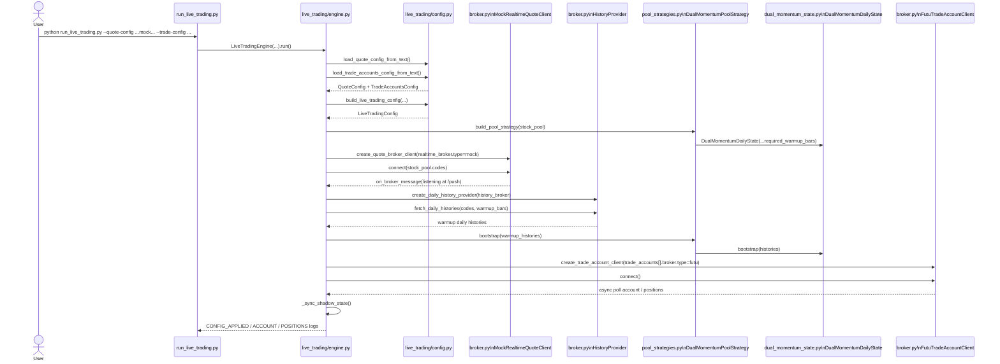
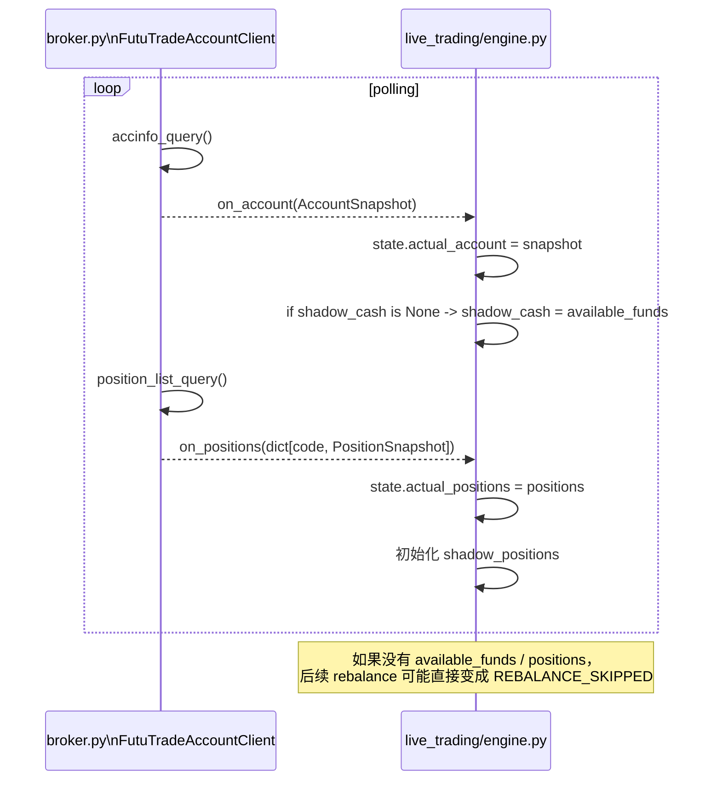
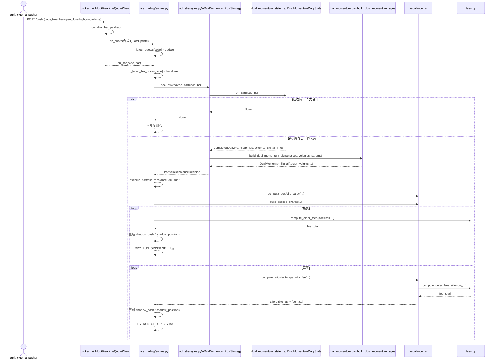

# `run_live_trading.py` + mock 行情 时序图

适用命令：

```bash
./.venv/bin/python run_live_trading.py \
  --quote-config config/live_trading.quote.mock.sample.json \
  --trade-config config/live_trading.trade_accounts.sample.json
```

下面的时序图主要聚焦这些文件之间的交互：

- [run_live_trading.py](/Users/sean/workspace/backtest-feature-livetrading-startup/run_live_trading.py)
- [live_trading/engine.py](/Users/sean/workspace/backtest-feature-livetrading-startup/live_trading/engine.py)
- [live_trading/config.py](/Users/sean/workspace/backtest-feature-livetrading-startup/live_trading/config.py)
- [live_trading/broker.py](/Users/sean/workspace/backtest-feature-livetrading-startup/live_trading/broker.py)
- [live_trading/pool_strategies.py](/Users/sean/workspace/backtest-feature-livetrading-startup/live_trading/pool_strategies.py)
- [strategy/dual_momentum_state.py](/Users/sean/workspace/backtest-feature-livetrading-startup/strategy/dual_momentum_state.py)
- [strategy/dual_momentum.py](/Users/sean/workspace/backtest-feature-livetrading-startup/strategy/dual_momentum.py)
- [strategy/rebalance.py](/Users/sean/workspace/backtest-feature-livetrading-startup/strategy/rebalance.py)
- [strategy/fees.py](/Users/sean/workspace/backtest-feature-livetrading-startup/strategy/fees.py)

## 1. 启动 + 配置加载 + warm-up



这一步的关键点：

- `mock` 只用于实时行情入口
- 策略 warm-up 仍然走 `history_broker`
- 账户资金和持仓仍然走 `trade_accounts[].broker`

## 2. 账户同步对后续调仓的影响



这就是为什么现在即使行情改成 mock，仍然需要交易账户侧先同步到资金和持仓。

## 3. mock 推送分钟 K -> 策略出信号 -> dry-run 调仓



这里最重要的时序关系是：

1. `mock` 收到 `/push`
2. 先发 `on_quote`
3. 再发 `on_bar`
4. `engine` 把 bar 交给 `DualMomentumPoolStrategy`
5. `DualMomentumDailyState` 只有在“交易日切换”时才会吐出已完成日线窗口
6. `build_dual_momentum_signal(...)` 生成目标权重
7. `engine` 用 `rebalance.py + fees.py` 做 dry-run 调仓和手续费计算

## 4. 文件职责对照

- [run_live_trading.py](/Users/sean/workspace/backtest-feature-livetrading-startup/run_live_trading.py)
  - CLI 入口，只负责启动和停止 engine
- [live_trading/config.py](/Users/sean/workspace/backtest-feature-livetrading-startup/live_trading/config.py)
  - 解析 quote / trade 两份配置，拼成 `LiveTradingConfig`
- [live_trading/broker.py](/Users/sean/workspace/backtest-feature-livetrading-startup/live_trading/broker.py)
  - 提供：
    - mock 实时行情入口
    - history provider
    - trade account client
- [live_trading/engine.py](/Users/sean/workspace/backtest-feature-livetrading-startup/live_trading/engine.py)
  - 把行情、账户、策略、dry-run 执行串起来
- [live_trading/pool_strategies.py](/Users/sean/workspace/backtest-feature-livetrading-startup/live_trading/pool_strategies.py)
  - live 侧股票池策略适配层
- [strategy/dual_momentum_state.py](/Users/sean/workspace/backtest-feature-livetrading-startup/strategy/dual_momentum_state.py)
  - 把分钟 bar 增量聚合成“已完成日线窗口”
- [strategy/dual_momentum.py](/Users/sean/workspace/backtest-feature-livetrading-startup/strategy/dual_momentum.py)
  - 纯信号逻辑，输出 `target_weights`
- [strategy/rebalance.py](/Users/sean/workspace/backtest-feature-livetrading-startup/strategy/rebalance.py)
  - 执行层的目标股数、可买数量、调仓带
- [strategy/fees.py](/Users/sean/workspace/backtest-feature-livetrading-startup/strategy/fees.py)
  - 手续费计算

## 5. 一句话总结

这条 mock 实盘链路本质上是：

```text
HTTP push 的分钟 bar
-> broker.py(mock)
-> engine.py
-> pool_strategies.py
-> dual_momentum_state.py
-> dual_momentum.py
-> rebalance.py + fees.py
-> engine.py 输出 DRY_RUN_ORDER
```

## 6. 从这个时序图看，哪些地方适合重构

结论先说：

- 优先重构 `live_trading/broker.py`
- 第二优先重构 `live_trading/engine.py`
- `strategy/*.py` 暂时不是主要矛盾

原因很直接：从时序图看，策略层已经基本按“状态聚合 -> 信号生成 -> 执行计算”分层了；真正职责过密的是实盘接线层。

### 6.1 `broker.py` 里的 mock 最适合先拆

当前 [live_trading/broker.py](/Users/sean/workspace/backtest-feature-livetrading-startup/live_trading/broker.py#L273) 这一段 `MockRealtimeQuoteClient` 同时承担了：

- HTTP server 生命周期
- `/health` / `/push` 协议
- payload 校验和归一化
- 合成 `QuoteUpdate`
- 推送 `bar`
- 订阅代码过滤

这几件事放在一个类里，直接后果是：

- 单测粒度太粗
- replay / 文件回放没法复用核心逻辑
- 后面如果要加 mock account，也会继续把 `broker.py` 堆大

建议拆成：

- `live_trading/mock_http.py`
  - `MockPushServer`
- `live_trading/mock_market_data.py`
  - `MockBarPayloadNormalizer`
  - `MockMarketDataEmitter`
- `live_trading/broker.py`
  - 只保留 `create_quote_broker_client(...)` 和 client 组装

这一步基本不改外部行为，风险最低，最适合先做。

### 6.2 `engine.py` 的 `apply_config()` 职责过密

[live_trading/engine.py#L104](/Users/sean/workspace/backtest-feature-livetrading-startup/live_trading/engine.py#L104) 的 `apply_config()` 当前同时做了：

- config diff
- quote broker 重连
- history provider 重建
- strategy 构建
- warm-up 拉取
- strategy bootstrap
- trade account client 生命周期管理
- shadow state 同步

这说明它已经不是单纯“apply config”，而是一个 runtime coordinator。

建议后续拆成几个内部服务：

- `RuntimeConfigCoordinator`
- `HistoryWarmupService`
- `TradeAccountRegistry`

第一步甚至不需要新文件，先把 `apply_config()` 内部拆成私有方法也值得：

- `_refresh_quote_broker(...)`
- `_refresh_history_provider(...)`
- `_refresh_pool_strategy(...)`
- `_refresh_trade_accounts(...)`
- `_finalize_runtime_state(...)`

### 6.3 dry-run 执行器可以从 `engine.py` 抽离

[live_trading/engine.py#L392](/Users/sean/workspace/backtest-feature-livetrading-startup/live_trading/engine.py#L392) 到 [live_trading/engine.py#L535](/Users/sean/workspace/backtest-feature-livetrading-startup/live_trading/engine.py#L535) 这一整段，其实已经是一个完整的“组合调仓执行器”：

- 输入
  - `PortfolioRebalanceDecision`
  - `TradeAccountConfig`
  - `TradeAccountState`
  - 参考价
- 处理
  - `compute_portfolio_value`
  - `build_desired_shares`
  - `compute_order_fees`
  - `compute_affordable_qty_with_fee`
- 输出
  - 更新 shadow state
  - 打 `DRY_RUN_REBALANCE` / `DRY_RUN_ORDER`

所以它非常适合抽成：

- `live_trading/execution.py`
  - `DryRunRebalanceExecutor`

这样之后：

- engine 只负责“收到 decision 后调用执行器”
- mock account / real account / future order router 都更容易接

### 6.4 账户状态管理也值得单独抽一层

[live_trading/engine.py#L337](/Users/sean/workspace/backtest-feature-livetrading-startup/live_trading/engine.py#L337) `_apply_trade_accounts_config()` 和 [live_trading/engine.py#L364](/Users/sean/workspace/backtest-feature-livetrading-startup/live_trading/engine.py#L364) `_sync_shadow_state()` 说明现在账户侧有两类状态混在一起：

- 实际账户状态
  - `actual_account`
  - `actual_positions`
- dry-run 影子状态
  - `shadow_cash`
  - `shadow_positions`

这部分后面如果要接 `MockTradeAccountClient`，很容易继续膨胀。

建议后续抽成：

- `AccountStateStore`
  - 管 actual/shadow 状态
  - 管 account_id/code 生命周期裁剪
  - 管首次同步默认值逻辑

这样 `engine.on_account()` / `engine.on_positions()` 可以明显变薄。

### 6.5 策略层目前反而比较健康

从时序图反推，目前策略侧边界是清楚的：

- [live_trading/pool_strategies.py](/Users/sean/workspace/backtest-feature-livetrading-startup/live_trading/pool_strategies.py#L37)
  - live adapter
- [strategy/dual_momentum_state.py](/Users/sean/workspace/backtest-feature-livetrading-startup/strategy/dual_momentum_state.py)
  - 分钟 bar -> 已完成日线窗口
- [strategy/dual_momentum.py](/Users/sean/workspace/backtest-feature-livetrading-startup/strategy/dual_momentum.py)
  - 纯信号
- [strategy/rebalance.py](/Users/sean/workspace/backtest-feature-livetrading-startup/strategy/rebalance.py)
  - 执行层计算

所以现在不建议优先动：

- `dual_momentum.py`
- `dual_momentum_state.py`
- `rebalance.py`

除非你要改策略语义本身，否则收益不如先拆实盘层。

## 7. 建议的重构顺序

建议按这个顺序做：

1. 先把 `broker.py` 里的 mock realtime 拆出去
2. 再把 `engine.py` 的 dry-run 执行器抽成 `execution.py`
3. 再抽账户状态存储
4. 最后再拆 `apply_config()` 的 runtime coordinator

原因：

- 第 1 步风险最低，而且和我们前面讨论的 mock 拆分目标一致
- 第 2 步能明显降低 `engine.py` 复杂度
- 第 3 步是给 mock trade account 铺路
- 第 4 步虽然也重要，但属于“整体整理”，不适合先动

## 8. 一句话建议

如果你准备开始重构，这条链路最合适的起点不是策略文件，而是：

```text
先拆 broker.py 的 mock
-> 再拆 engine.py 的 dry-run executor
-> 再补 mock trade account
```
