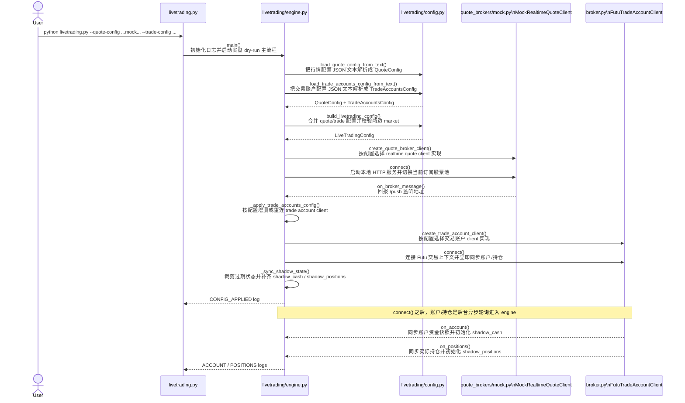
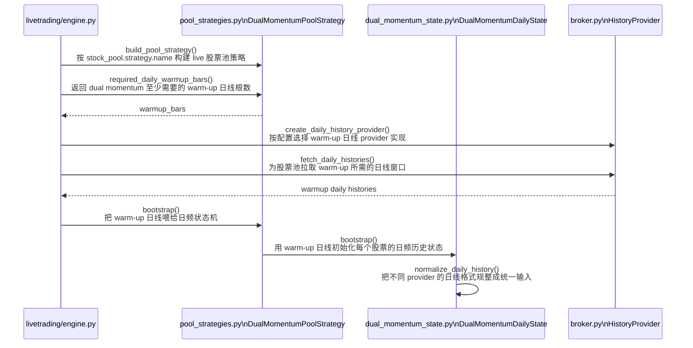
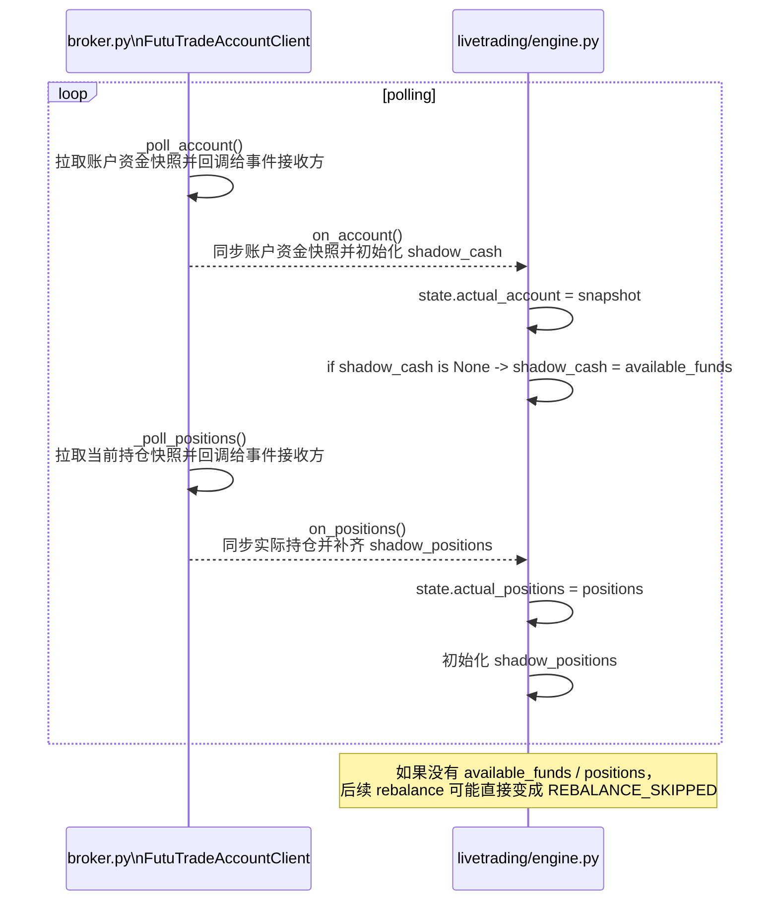
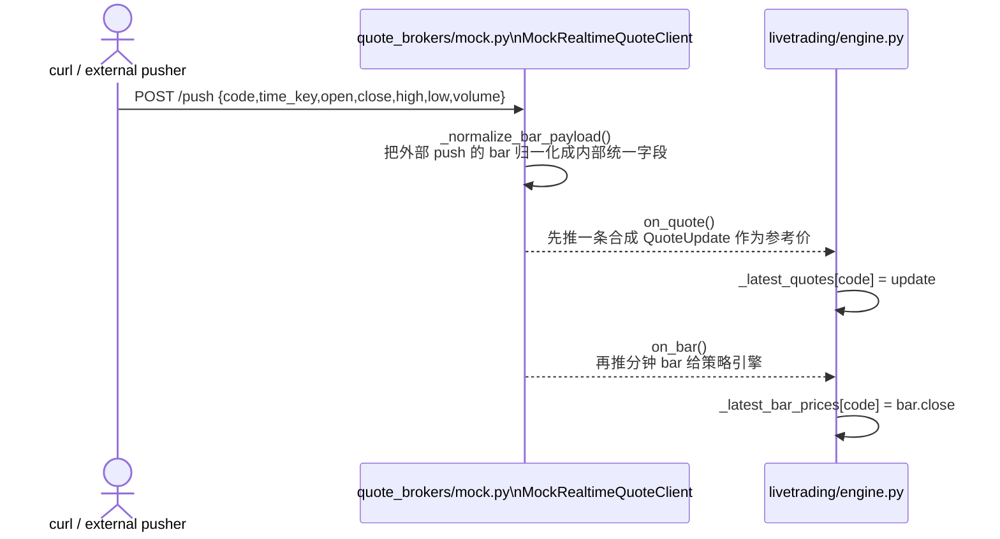
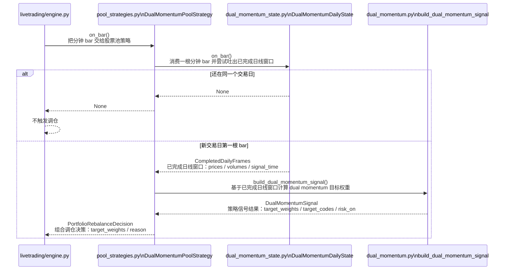
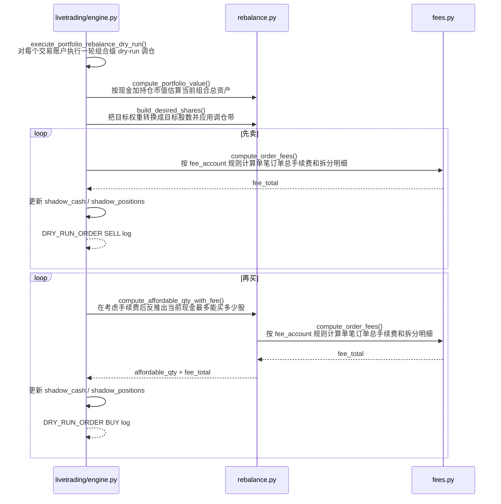

# `livetrading.py` + mock 行情 时序图

适用命令：

```bash
./.venv/bin/python livetrading.py \
  --quote-config config/livetrading.quote.mock.sample.json \
  --trade-config config/livetrading.trade_accounts.sample.json
```

下面的时序图主要聚焦这些文件之间的交互：

- [livetrading.py](/Users/sean/workspace/backtest-feature-livetrading-startup/livetrading.py)
- [livetrading/engine.py](/Users/sean/workspace/backtest-feature-livetrading-startup/livetrading/engine.py)
- [livetrading/config.py](/Users/sean/workspace/backtest-feature-livetrading-startup/livetrading/config.py)
- [livetrading/broker.py](/Users/sean/workspace/backtest-feature-livetrading-startup/livetrading/broker.py)
- [livetrading/quote_brokers/mock.py](/Users/sean/workspace/backtest-feature-livetrading-startup/livetrading/quote_brokers/mock.py)
- [livetrading/pool_strategies.py](/Users/sean/workspace/backtest-feature-livetrading-startup/livetrading/pool_strategies.py)
- [strategy/dual_momentum_state.py](/Users/sean/workspace/backtest-feature-livetrading-startup/strategy/dual_momentum_state.py)
- [strategy/dual_momentum.py](/Users/sean/workspace/backtest-feature-livetrading-startup/strategy/dual_momentum.py)
- [strategy/rebalance.py](/Users/sean/workspace/backtest-feature-livetrading-startup/strategy/rebalance.py)
- [strategy/fees.py](/Users/sean/workspace/backtest-feature-livetrading-startup/strategy/fees.py)

下面 Mermaid 里的方法说明，和代码里对应方法的中文注释保持一致，方便你对着图直接跳代码。

## 1. 启动 + 配置加载



这一步的关键点：

- `mock` 只用于实时行情入口
- 配置文件读取、broker 初始化、trade account 连接都在这一段完成
- warm-up 本身单独放到下一张图看

## 2. warm-up



这一步的关键点：

- 策略 warm-up 仍然走 `history_broker`
- warm-up 的输出是“已完成日线窗口”，不是直接下单指令
- 真正的账户资金和持仓同步在下一张图里单独看

## 3. 账户同步对后续调仓的影响



这就是为什么现在即使行情改成 mock，仍然需要交易账户侧先同步到资金和持仓。

## 4. mock 推送分钟 K -> 策略出信号 -> dry-run 调仓

### 4.1 mock 接收 `/push` 并把行情送进引擎



### 4.2 分钟 bar 进入策略层，并在换日时决定是否出信号



### 4.3 引擎按账户执行 dry-run 调仓



这里最重要的时序关系是：

1. `mock` 收到 `/push` 后，会先发 `on_quote`，再发 `on_bar`。
2. 策略层只有在“新交易日第一根分钟 bar”到来时，才会从 `DualMomentumDailyState` 吐出已完成日线窗口。
3. `build_dual_momentum_signal(...)` 用这份已完成日线窗口生成目标权重。
4. 引擎拿到 `PortfolioRebalanceDecision` 后，按账户逐个执行 dry-run。
5. dry-run 执行顺序是先卖后买，并且买入数量会显式考虑手续费和剩余现金。

## 5. 文件职责对照

- [livetrading.py](/Users/sean/workspace/backtest-feature-livetrading-startup/livetrading.py)
  - CLI 入口，只负责启动和停止 engine
- [livetrading/config.py](/Users/sean/workspace/backtest-feature-livetrading-startup/livetrading/config.py)
  - 解析 quote / trade 两份配置，拼成 `LiveTradingConfig`
- [livetrading/broker.py](/Users/sean/workspace/backtest-feature-livetrading-startup/livetrading/broker.py)
  - 提供：
    - quote broker factory
    - history provider
    - trade account client
- [livetrading/quote_brokers/mock.py](/Users/sean/workspace/backtest-feature-livetrading-startup/livetrading/quote_brokers/mock.py)
  - mock 实时行情入口
  - 负责 `/health` / `/push`、bar 归一化、合成 quote、再推 bar
- [livetrading/engine.py](/Users/sean/workspace/backtest-feature-livetrading-startup/livetrading/engine.py)
  - 把行情、账户、策略、dry-run 执行串起来
- [livetrading/pool_strategies.py](/Users/sean/workspace/backtest-feature-livetrading-startup/livetrading/pool_strategies.py)
  - live 侧股票池策略适配层
- [strategy/dual_momentum_state.py](/Users/sean/workspace/backtest-feature-livetrading-startup/strategy/dual_momentum_state.py)
  - 把分钟 bar 增量聚合成“已完成日线窗口”
- [strategy/dual_momentum.py](/Users/sean/workspace/backtest-feature-livetrading-startup/strategy/dual_momentum.py)
  - 纯信号逻辑，输出 `target_weights`
- [strategy/rebalance.py](/Users/sean/workspace/backtest-feature-livetrading-startup/strategy/rebalance.py)
  - 执行层的目标股数、可买数量、调仓带
- [strategy/fees.py](/Users/sean/workspace/backtest-feature-livetrading-startup/strategy/fees.py)
  - 手续费计算

## 6. 一句话总结

这条 mock 实盘链路本质上是：

```text
HTTP push 的分钟 bar
-> quote_brokers/mock.py
-> engine.py
-> pool_strategies.py
-> dual_momentum_state.py
-> dual_momentum.py
-> rebalance.py + fees.py
-> engine.py 输出 DRY_RUN_ORDER
```

## 7. 从这个时序图看，哪些地方适合重构

结论先说：

- 优先重构 realtime quote mock 这一层，也就是 `livetrading/quote_brokers/mock.py`
- 第二优先重构 `livetrading/engine.py`
- `strategy/*.py` 暂时不是主要矛盾

原因很直接：从时序图看，策略层已经基本按“状态聚合 -> 信号生成 -> 执行计算”分层了；真正职责过密的是实盘接线层，尤其是 realtime mock 和 engine。

### 7.1 `quote_brokers/mock.py` 里的 mock realtime 适合继续细拆

当前 [livetrading/quote_brokers/mock.py#L16](/Users/sean/workspace/backtest-feature-livetrading-startup/livetrading/quote_brokers/mock.py#L16) 这一段 `MockRealtimeQuoteClient` 同时承担了：

- HTTP server 生命周期
- `/health` / `/push` 协议
- payload 校验和归一化
- 合成 `QuoteUpdate`
- 推送 `bar`
- 订阅代码过滤

这几件事放在一个类里，直接后果是：

- 单测粒度太粗
- replay / 文件回放没法复用核心逻辑
- 后面如果要加 mock account，也会继续把实盘接线层堆大

建议拆成：

- `livetrading/mock_http.py`
  - `MockPushServer`
- `livetrading/mock_market_data.py`
  - `MockBarPayloadNormalizer`
  - `MockMarketDataEmitter`
- `livetrading/quote_brokers/mock.py`
  - 只保留 client orchestration
- `livetrading/broker.py`
  - 继续保留 `create_quote_broker_client(...)` 这类 factory

这一步不需要再做一次“从 `broker.py` 搬到 `quote_brokers/mock.py`”的大迁移，因为这一步已经完成了；现在要做的是把 `quote_brokers/mock.py` 内部职责继续拆细。

### 7.2 `engine.py` 的 `apply_config()` 职责过密

[livetrading/engine.py#L104](/Users/sean/workspace/backtest-feature-livetrading-startup/livetrading/engine.py#L104) 的 `apply_config()` 当前同时做了：

- config diff
- quote broker 重连
- history provider 重建
- strategy 构建
- warm-up 拉取
- strategy bootstrap
- trade account client 生命周期管理
- shadow state 同步

这说明它已经不是单纯“apply config”，而是一个 runtime coordinator。

建议后续拆成几个内部服务：

- `RuntimeConfigCoordinator`
- `HistoryWarmupService`
- `TradeAccountRegistry`

第一步甚至不需要新文件，先把 `apply_config()` 内部拆成私有方法也值得：

- `_refresh_quote_broker(...)`
- `_refresh_history_provider(...)`
- `_refresh_pool_strategy(...)`
- `_refresh_trade_accounts(...)`
- `_finalize_runtime_state(...)`

### 7.3 dry-run 执行器可以从 `engine.py` 抽离

[livetrading/engine.py#L392](/Users/sean/workspace/backtest-feature-livetrading-startup/livetrading/engine.py#L392) 到 [livetrading/engine.py#L535](/Users/sean/workspace/backtest-feature-livetrading-startup/livetrading/engine.py#L535) 这一整段，其实已经是一个完整的“组合调仓执行器”：

- 输入
  - `PortfolioRebalanceDecision`
  - `TradeAccountConfig`
  - `TradeAccountState`
  - 参考价
- 处理
  - `compute_portfolio_value`
  - `build_desired_shares`
  - `compute_order_fees`
  - `compute_affordable_qty_with_fee`
- 输出
  - 更新 shadow state
  - 打 `DRY_RUN_REBALANCE` / `DRY_RUN_ORDER`

所以它非常适合抽成：

- `livetrading/execution.py`
  - `DryRunRebalanceExecutor`

这样之后：

- engine 只负责“收到 decision 后调用执行器”
- mock account / real account / future order router 都更容易接

### 7.4 账户状态管理也值得单独抽一层

[livetrading/engine.py#L337](/Users/sean/workspace/backtest-feature-livetrading-startup/livetrading/engine.py#L337) `_apply_trade_accounts_config()` 和 [livetrading/engine.py#L364](/Users/sean/workspace/backtest-feature-livetrading-startup/livetrading/engine.py#L364) `_sync_shadow_state()` 说明现在账户侧有两类状态混在一起：

- 实际账户状态
  - `actual_account`
  - `actual_positions`
- dry-run 影子状态
  - `shadow_cash`
  - `shadow_positions`

这部分后面如果要接 `MockTradeAccountClient`，很容易继续膨胀。

建议后续抽成：

- `AccountStateStore`
  - 管 actual/shadow 状态
  - 管 account_id/code 生命周期裁剪
  - 管首次同步默认值逻辑

这样 `engine.on_account()` / `engine.on_positions()` 可以明显变薄。

### 7.5 策略层目前反而比较健康

从时序图反推，目前策略侧边界是清楚的：

- [livetrading/pool_strategies.py](/Users/sean/workspace/backtest-feature-livetrading-startup/livetrading/pool_strategies.py#L37)
  - live adapter
- [strategy/dual_momentum_state.py](/Users/sean/workspace/backtest-feature-livetrading-startup/strategy/dual_momentum_state.py)
  - 分钟 bar -> 已完成日线窗口
- [strategy/dual_momentum.py](/Users/sean/workspace/backtest-feature-livetrading-startup/strategy/dual_momentum.py)
  - 纯信号
- [strategy/rebalance.py](/Users/sean/workspace/backtest-feature-livetrading-startup/strategy/rebalance.py)
  - 执行层计算

所以现在不建议优先动：

- `dual_momentum.py`
- `dual_momentum_state.py`
- `rebalance.py`

除非你要改策略语义本身，否则收益不如先拆实盘层。

## 8. 建议的重构顺序

建议按这个顺序做：

1. 先把 `quote_brokers/mock.py` 内部拆成 server / normalizer / emitter
2. 再把 `engine.py` 的 dry-run 执行器抽成 `execution.py`
3. 再抽账户状态存储
4. 最后再拆 `apply_config()` 的 runtime coordinator

原因：

- 第 1 步风险最低，而且和当前代码状态一致
- 第 2 步能明显降低 `engine.py` 复杂度
- 第 3 步是给 mock trade account 铺路
- 第 4 步虽然也重要，但属于“整体整理”，不适合先动

## 9. 一句话建议

如果你准备开始重构，这条链路最合适的起点不是策略文件，而是：

```text
先细拆 quote_brokers/mock.py
-> 再拆 engine.py 的 dry-run executor
-> 再补 mock trade account
```
