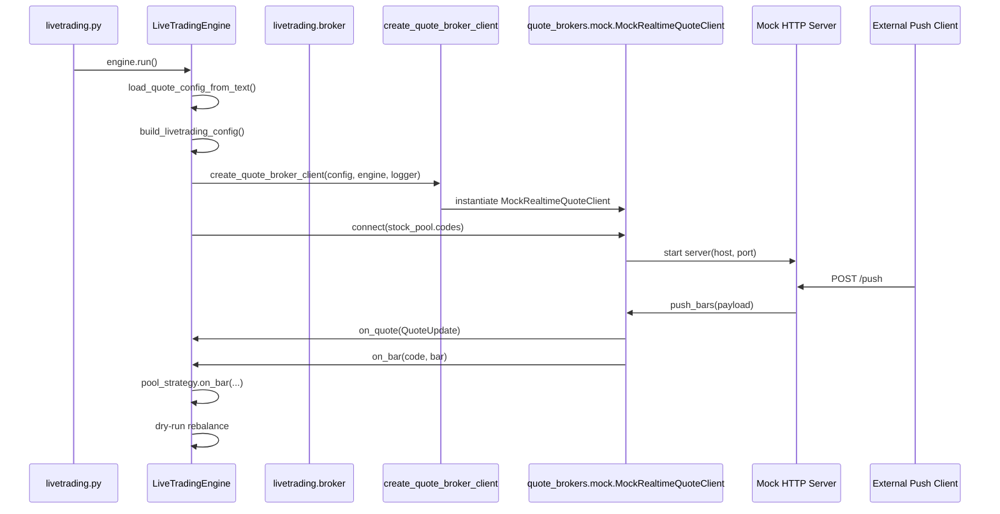
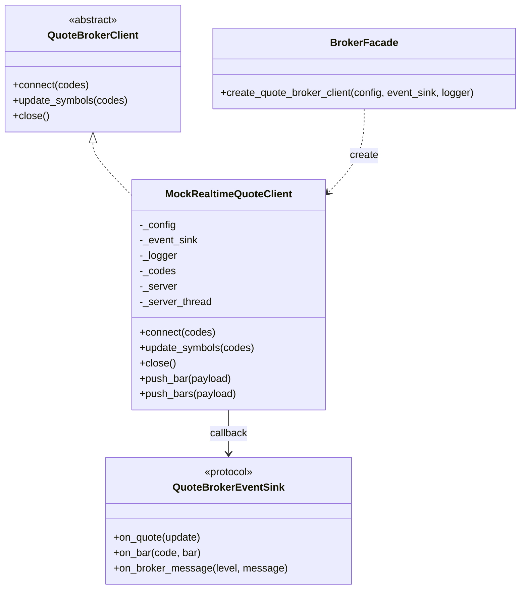

# livetrading mock 拆分技术方案

## 1. 背景

当前 `livetrading/broker.py` 同时承载了多类职责：

- quote 抽象：`QuoteBrokerClient`、`QuoteBrokerEventSink`
- quote 实现：`FutuRealtimeQuoteClient`、`MockRealtimeQuoteClient`
- history 抽象与实现：`DailyHistoryProvider` 及本地 / Futu / Polygon provider
- trade 抽象与实现：`TradeAccountClient` 及 Futu 交易客户端
- 工厂函数：`create_quote_broker_client()`、`create_daily_history_provider()`、`create_trade_account_client()`

这导致 `broker.py` 文件过大、职责混杂，也让 `mock` 这一块开发 / 验证专用逻辑与生产路径上的 Futu / history / trade 代码耦合在一起。

但从运行时依赖关系看，`engine` 对 quote 侧已经做了较好的抽象隔离：

- `LiveTradingEngine.__init__()` 只依赖 `quote_broker_factory`
- 默认工厂是 `create_quote_broker_client()`
- `apply_config()` 只通过 `QuoteBrokerClient` 抽象调用 `connect()` / `update_symbols()` / `close()`

因此，本次方案的核心不是重写运行架构，而是把 `mock` 从模块组织上拆出来，同时保持外部行为和调用链不变。

## 2. 目标

### 2.1 本次目标

- 将 `MockRealtimeQuoteClient` 从 `livetrading/broker.py` 中独立拆出
- 消除 `mock` 实现与 `broker.py` 内其他非 quote 代码的物理耦合
- 保持 `engine.py`、`config.py`、README 中的使用方式不变
- 保持 mock HTTP API 兼容：
  - `GET /health`
  - `POST /push`
  - 单条 bar 和批量 `bars[]` 负载格式
- 保持现有测试和外部导入路径尽量不变

### 2.2 非目标

- 本次不调整策略逻辑
- 本次不调整 quote 配置 JSON schema
- 本次不改动 `engine` 的事件处理流程
- 本次不拆 history provider / trade client
- 本次不引入新的第三方依赖

## 3. 现状与问题

### 3.1 当前主调用链

运行 mock 行情时，当前调用链如下：

1. `livetrading.py` 创建 `LiveTradingEngine`
2. `engine.run()` 加载 quote / trade 配置
3. `build_livetrading_config()` 合并配置
4. `engine.apply_config()` 根据 `realtime_broker.type` 创建 quote client
5. `create_quote_broker_client()` 返回 `MockRealtimeQuoteClient`
6. `MockRealtimeQuoteClient.connect()` 启动本地 HTTP server，并把 `stock_pool.codes` 保存为当前订阅 symbols
7. 外部通过 `POST /push` 推 bar
8. `MockRealtimeQuoteClient.push_bars()` / `push_bar()` 先发 `on_quote()`，再发 `on_bar()`
9. `engine.on_bar()` 把 bar 喂给 pool strategy，并继续触发 dry-run rebalance

### 3.2 当前存在的问题

- `broker.py` 文件边界过大，后续阅读和维护成本高
- `mock` 与 `futu` quote 实现并列写在同一文件里，但它们的依赖和用途不同
- `mock` 的 HTTP server、payload 归一化、事件桥接逻辑都埋在 `broker.py` 中，不利于单独测试
- 如果后续再加新的 quote broker，实现会继续堆叠在同一文件中
- 直接从 `broker.py` 提取 `MockRealtimeQuoteClient` 会遇到循环依赖风险，因此需要先明确抽象边界

## 4. 设计原则

- 运行链路保持稳定，优先做模块边界整理
- 对外接口兼容优先于内部结构纯度
- 第一阶段优先拆 `mock`，不扩大为整套 broker 体系重构
- 避免循环依赖
- 让 `engine.py` 不感知本次拆分

## 5. 目标目录草图

当前建议目录结构已经落到这一级：

```text
livetrading/
  broker.py
  quote_brokers/
    __init__.py
    base.py
    mock.py
    futu.py
```

### 5.1 文件职责

| 文件 | 职责 |
| --- | --- |
| `livetrading/broker.py` | 保留兼容导出、quote 工厂、history/trade 相关实现 |
| `livetrading/quote_brokers/base.py` | quote 侧抽象：`QuoteBrokerClient`、`QuoteBrokerEventSink` |
| `livetrading/quote_brokers/mock.py` | `MockRealtimeQuoteClient` 及其 HTTP push 逻辑 |
| `livetrading/quote_brokers/futu.py` | `FutuRealtimeQuoteClient` 与 Futu quote API 装载逻辑 |

### 5.2 下一步可选目录

如果后续还想继续清理 broker 侧，下一阶段应该考虑的是 history / trade 子域拆分，而不是再把 quote 侧留在 `broker.py`。

## 6. 目标运行时序

本次拆分后，运行时行为不变，只是模块边界变化。推荐用下面这张时序图表达：



这张图的重点是：

- `engine` 依然只依赖 factory + `QuoteBrokerClient`
- `mock` 的变化只发生在 `broker.py` 内部的模块分布，不影响 `engine`
- `POST /push` 的外部使用方式保持不变

## 7. 目标类结构

建议采用下面的类关系：



说明：

- `MockRealtimeQuoteClient` 继续实现 `QuoteBrokerClient`
- `engine` 继续充当 `QuoteBrokerEventSink`
- `broker.py` 的工厂继续作为兼容外观层存在

## 8. 详细拆分方案

### 8.1 第一步：抽出 quote 抽象

新建 `livetrading/quote_brokers/base.py`，迁移以下定义：

- `QuoteBrokerClient`
- `QuoteBrokerEventSink`

这样做的原因是：

- `mock.py` 需要依赖 quote 抽象
- `broker.py` 也需要依赖 quote 抽象
- 如果抽象仍留在 `broker.py`，而 `broker.py` 又要 import `mock.py` 来做 factory 分发，就容易形成循环导入

建议骨架如下：

```python
from __future__ import annotations

from abc import ABC, abstractmethod
from typing import Any, Iterable, Protocol

import pandas as pd

from ..models import QuoteUpdate


class QuoteBrokerEventSink(Protocol):
    def on_quote(self, update: QuoteUpdate) -> None: ...
    def on_bar(self, code: str, bar: pd.Series | dict[str, Any]) -> None: ...
    def on_broker_message(self, level: int, message: str) -> None: ...


class QuoteBrokerClient(ABC):
    @abstractmethod
    def connect(self, codes: Iterable[str]) -> None:
        raise NotImplementedError

    @abstractmethod
    def update_symbols(self, codes: Iterable[str]) -> None:
        raise NotImplementedError

    @abstractmethod
    def close(self) -> None:
        raise NotImplementedError
```

### 8.2 第二步：抽出 mock quote 实现

新建 `livetrading/quote_brokers/mock.py`，迁移以下内容：

- `MockRealtimeQuoteClient`
- 其私有 helper：
  - `_build_server()`
  - `_normalize_codes()`
  - `_normalize_bar_payload()`

这个模块只需要依赖：

- `RealtimeQuoteBrokerConfig`
- `QuoteUpdate`
- `QuoteBrokerClient`
- `QuoteBrokerEventSink`
- 标准库 HTTP server / threading
- `pandas`

不需要依赖 history provider、trade client、Futu API 相关逻辑。

建议模块职责保持单一：

- 负责管理 mock quote 生命周期
- 负责维护当前订阅代码列表
- 负责暴露 `/health` 与 `/push`
- 负责把推入的 JSON 负载转换成统一 quote/bar 事件

### 8.3 第三步：保留 `broker.py` 作为兼容外观层

第一阶段不建议直接让 `engine.py` 改 import 路径。更稳妥的方式是：

- `engine.py` 继续 `from .broker import create_quote_broker_client`
- `broker.py` 继续暴露 `create_quote_broker_client()`
- `broker.py` 内部改为 import 新的 `MockRealtimeQuoteClient`

推荐做法：

1. `broker.py` 顶部从 `quote_brokers.base` 引入 quote 抽象
2. `broker.py` 顶部从 `quote_brokers.mock` 引入 `MockRealtimeQuoteClient`
3. `create_quote_broker_client()` 保持签名不变
4. 继续兼容导出 `MockRealtimeQuoteClient`

这样外部调用链完全不变，拆分成本最低。

### 8.4 为什么不在第一步就拆 HTTP server

虽然从“纯架构”角度可以继续把 mock 内部再拆成：

- `MockQuotePushServer`
- `MockBarPayloadNormalizer`
- `MockRealtimeQuoteClient`

但本次不建议这样做，原因是：

- 当前 `mock` 的复杂度不高
- 过早细分会增加新文件数量和迁移成本
- 当前首要问题是把 `mock` 从 `broker.py` 中独立出来，而不是继续做 mock 模块内二次分层

结论是：

- 第一阶段：整体迁出 `MockRealtimeQuoteClient`
- 第二阶段：如果 mock 逻辑继续增长，再考虑 server / adapter 内部分层

## 9. import 关系设计

推荐的目标 import 方向如下：

```text
engine.py -> broker.py
broker.py -> quote_brokers.base
broker.py -> quote_brokers.mock
quote_brokers.mock -> quote_brokers.base
quote_brokers.mock -> config.py
quote_brokers.mock -> models.py
```

需要避免的反向依赖是：

```text
quote_brokers.mock -> broker.py
```

因为这会让 `broker.py` 与 `mock.py` 互相 import，形成循环依赖风险。

## 10. 兼容性策略

### 10.1 保持工厂函数签名不变

以下接口应保持不变：

```python
def create_quote_broker_client(
    config: RealtimeQuoteBrokerConfig,
    event_sink: QuoteBrokerEventSink,
    logger: logging.Logger,
) -> QuoteBrokerClient:
    ...
```

这样可以确保：

- `engine.py` 不需要调整
- 依赖 `quote_broker_factory` 注入点的测试不需要调整

### 10.2 保持 mock HTTP 协议不变

以下外部约定应保持兼容：

- `GET /health`
- `POST /push`
- `{"code": ..., "time_key": ..., ...}`
- `{"bars": [...]}`
- 返回字段：
  - `accepted`
  - `ignored`
  - `subscribed_codes`

### 10.3 保持旧导入路径可用

为了减少现有调用点和测试的修改量，第一阶段建议 `livetrading.broker` 继续 re-export：

- `QuoteBrokerClient`
- `QuoteBrokerEventSink`
- `MockRealtimeQuoteClient`

这样像下面这类代码在第一阶段仍然可用：

```python
from livetrading.broker import MockRealtimeQuoteClient
```

## 11. 推荐的实施步骤

### Phase 1: 基础抽象迁移

- 新建 `livetrading/quote_brokers/__init__.py`
- 新建 `livetrading/quote_brokers/base.py`
- 将 quote 抽象迁入 `base.py`
- `broker.py` 改为从 `base.py` import quote 抽象

验收点：

- 项目 import 正常
- `engine.py` 无需修改运行逻辑

### Phase 2: mock 实现迁移

- 新建 `livetrading/quote_brokers/mock.py`
- 迁出 `MockRealtimeQuoteClient`
- `broker.py` 工厂改为从新模块创建 mock client
- `broker.py` 保留 `MockRealtimeQuoteClient` 兼容导出

验收点：

- mock 模式仍可启动本地 HTTP server
- `/health` 行为不变
- `/push` 仍可触发 quote/bar 回调

### Phase 3: 测试与文档对齐

- 为 `quote_brokers/mock.py` 增加独立单元测试
- 补充 broker facade 兼容性测试
- 更新 README / docs 中关于 mock 的架构描述

验收点：

- 现有测试继续通过
- 新增测试覆盖拆分后的关键行为

### Phase 4: 可选后续清理

- 评估是否将 `FutuRealtimeQuoteClient` 迁入 `quote_brokers/futu.py`
- 评估是否继续拆 history / trade 子域

## 12. 测试计划

### 12.1 单元测试

为 `quote_brokers/mock.py` 增加测试，覆盖：

- `connect()` 后 server 成功启动
- `update_symbols()` 后订阅代码更新
- 未订阅 symbol 的 push 被忽略
- 单条 push 成功转成 `on_quote()` + `on_bar()`
- 批量 push 成功返回 `accepted` / `ignored`
- 非法 payload 返回错误
- `close()` 后 server 正常关闭

### 12.2 集成测试

沿用现有 `LiveTradingEngine` 级别测试，验证：

- `realtime_broker.type == "mock"` 时仍通过工厂得到 mock client
- `engine.run()` 配置加载链路不受影响
- mock bar 推送后仍能驱动 `engine.on_quote()` / `engine.on_bar()`

### 12.3 兼容性测试

新增导入兼容性验证：

```python
from livetrading.broker import MockRealtimeQuoteClient
from livetrading.broker import QuoteBrokerClient
```

确保拆分后旧路径仍可用。

## 13. 风险与规避

### 13.1 循环导入

风险：

- `mock.py` 如果继续 import `broker.py` 中的 quote 抽象，容易与 `broker.py -> mock.py` 形成循环

规避：

- 先抽 `quote_brokers/base.py`
- `mock.py` 只依赖 `base.py`，不反向依赖 `broker.py`

### 13.2 兼容性回归

风险：

- 测试和外部脚本可能直接从 `livetrading.broker` import `MockRealtimeQuoteClient`

规避：

- 第一阶段保留 re-export
- 后续如果要清理旧路径，再单独做弃用迁移

### 13.3 行为不一致

风险：

- mock server 的线程关闭、订阅代码过滤、payload 归一化逻辑在迁移时出现偏差

规避：

- 首次迁移尽量保持代码原样平移
- 先不做内部逻辑重构
- 用现有行为写回归测试后再继续清理

## 14. 交付物

本方案落地后，预期新增 / 修改文件如下：

新增：

- `livetrading/quote_brokers/__init__.py`
- `livetrading/quote_brokers/base.py`
- `livetrading/quote_brokers/mock.py`

修改：

- `livetrading/broker.py`
- `tests/test_livetrading.py`
- `README.md`
- `docs/README_livetrading_mock_signal.md`

其中：

- 第一阶段必要修改只有 `broker.py` 和新增文件
- README 与 docs 可在实现稳定后再补

## 15. 结论

推荐采用“先抽抽象，再迁 mock，实现层不动调用链”的最小侵入式拆分方案。

这个方案的优点是：

- 改动集中
- 对 `engine` 无侵入
- 避免循环依赖
- 兼容现有工厂与测试路径
- 为后续继续拆 `futu` quote 留出清晰扩展位

如果后续继续推进 broker 体系整理，再以这次的 `quote_brokers/` 作为起点逐步迁移，而不是一次性重写整个 `broker.py`。
