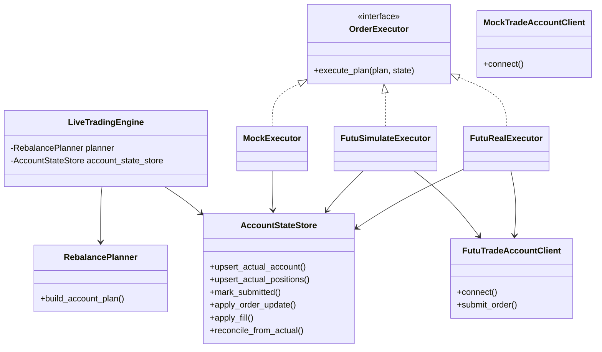
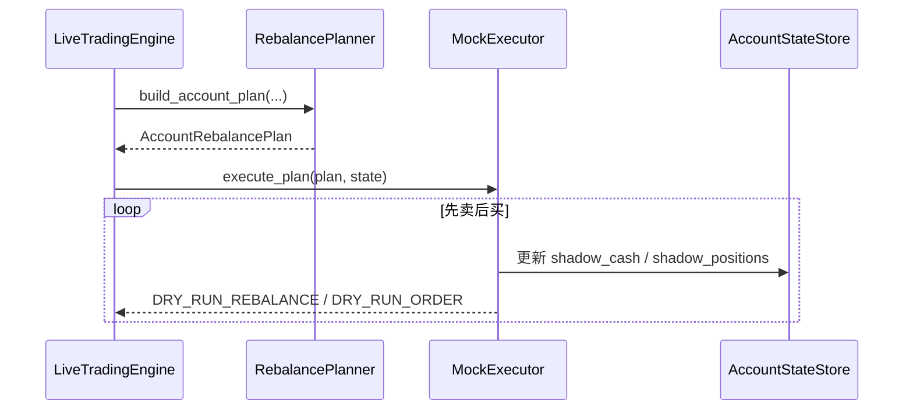
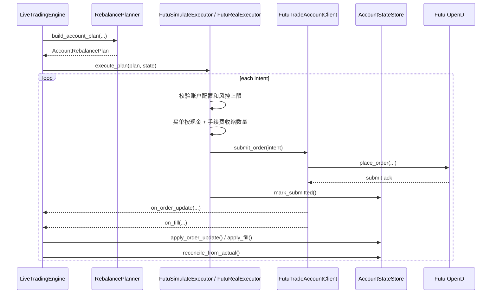

# livetrading 执行层说明

文件名虽然还叫 `real_order_plan`，但这份文档现在描述的是当前已经落地的执行层，不再是未来方案。

## 1. 当前现状

当前代码里，执行层已经固定成 3 种实现：

- `MockExecutor`
  - 不走 Futu 下单
  - 打印 `DRY_RUN_*` 日志
  - 维护本地 `shadow_cash / shadow_positions`
- `FutuSimulateExecutor`
  - 调用 Futu `place_order(...)`
  - 要求 `broker.trade_env = SIMULATE`
  - 维护 `expected_cash / expected_positions / pending_orders`
- `FutuRealExecutor`
  - 调用 Futu `place_order(...)`
  - 要求 `broker.trade_env = REAL`
  - 还要求 `execution.enable_real_trading = true`

也就是说，现在不是“只有 dry-run”，而是同一个策略信号会按账户配置走 3 选 1。

## 2. 配置规则

最重要的是分清 3 个字段：

- `broker.type`
  - 决定账户 client 是 `futu` 还是 `mock`
- `broker.trade_env`
  - 决定 Futu 走 `SIMULATE` 还是 `REAL`
- `execution.executor`
  - 决定执行器走 `mock`、`futu_simulate` 还是 `futu_real`

当前代码里的约束是：

1. `execution.executor = mock`
   - 可以配 `broker.type = mock`
   - 也可以配 `broker.type = futu`
2. `execution.executor = futu_simulate`
   - 必须配 `broker.type = futu`
   - 必须配 `broker.trade_env = SIMULATE`
3. `execution.executor = futu_real`
   - 必须配 `broker.type = futu`
   - 必须配 `broker.trade_env = REAL`
   - 必须配 `execution.enable_real_trading = true`
4. `broker.type = mock`
   - 只能配 `execution.executor = mock`

样例文件入口：

- `mock` 全本地联调：
  - [config/livetrading.quote.mock.sample.json](/Users/sean/workspace/backtest-feature-livetrading-startup/config/livetrading.quote.mock.sample.json)
  - [config/livetrading.history.local.sample.json](/Users/sean/workspace/backtest-feature-livetrading-startup/config/livetrading.history.local.sample.json)
  - [config/livetrading.pool.sample.json](/Users/sean/workspace/backtest-feature-livetrading-startup/config/livetrading.pool.sample.json)
  - [config/livetrading.trade_accounts.mock.sample.json](/Users/sean/workspace/backtest-feature-livetrading-startup/config/livetrading.trade_accounts.mock.sample.json)
- Futu 行情 + Futu 模拟提单：
  - [config/livetrading.quote.futu.sample.json](/Users/sean/workspace/backtest-feature-livetrading-startup/config/livetrading.quote.futu.sample.json)
  - [config/livetrading.history.polygon.sample.json](/Users/sean/workspace/backtest-feature-livetrading-startup/config/livetrading.history.polygon.sample.json)
  - [config/livetrading.pool.sample.json](/Users/sean/workspace/backtest-feature-livetrading-startup/config/livetrading.pool.sample.json)
  - [config/livetrading.trade_accounts.simulate.sample.json](/Users/sean/workspace/backtest-feature-livetrading-startup/config/livetrading.trade_accounts.simulate.sample.json)
- Futu 行情 + Futu 真实环境提单：
  - [config/livetrading.quote.futu.sample.json](/Users/sean/workspace/backtest-feature-livetrading-startup/config/livetrading.quote.futu.sample.json)
  - [config/livetrading.history.futu.sample.json](/Users/sean/workspace/backtest-feature-livetrading-startup/config/livetrading.history.futu.sample.json)
  - [config/livetrading.pool.sample.json](/Users/sean/workspace/backtest-feature-livetrading-startup/config/livetrading.pool.sample.json)
  - [config/livetrading.trade_accounts.futu.sample.json](/Users/sean/workspace/backtest-feature-livetrading-startup/config/livetrading.trade_accounts.futu.sample.json)

## 3. 代码分层

当前代码里，执行链路主要是这几个文件：

- [livetrading/execution.py](/Users/sean/workspace/backtest-feature-livetrading-startup/livetrading/execution.py)
  - `RebalancePlanner`
  - `OrderExecutor`
  - `MockExecutor`
  - `FutuSimulateExecutor`
  - `FutuRealExecutor`
- [livetrading/account_state.py](/Users/sean/workspace/backtest-feature-livetrading-startup/livetrading/account_state.py)
  - `AccountStateStore`
  - `PendingOrder`
  - `AccountRuntimeState`
- [livetrading/trade_accounts/futu.py](/Users/sean/workspace/backtest-feature-livetrading-startup/livetrading/trade_accounts/futu.py)
  - Futu 账户同步、下单、订单回报、成交回报
- [livetrading/trade_accounts/mock.py](/Users/sean/workspace/backtest-feature-livetrading-startup/livetrading/trade_accounts/mock.py)
  - 本地账户基线，不访问 Futu
- [livetrading/engine.py](/Users/sean/workspace/backtest-feature-livetrading-startup/livetrading/engine.py)
  - 串起策略信号、planner、executor、account state

职责边界是：

- `RebalancePlanner`
  - 只负责“该下什么单”
- `Executor`
  - 只负责“怎么执行这批单”
- `AccountStateStore`
  - 只负责“真实状态、影子状态、期望状态和 pending 订单怎么推进”

## 4. 账户状态怎么分

执行层现在同时维护 3 套视图：

- `actual_*`
  - 真实账户同步值
- `shadow_*`
  - 给 `MockExecutor` 用的影子现金和影子持仓
- `expected_*`
  - 给 `FutuSimulateExecutor / FutuRealExecutor` 用的预期现金和预期持仓

另外还有：

- `pending_orders`
  - 用来承接 `submit_order -> ORDER_UPDATE / FILL -> reconcile_from_actual` 这一段时间差

这也是为什么 live 提单路径不会像 mock 一样直接把 `shadow_*` 当成真实成交结果。

## 5. 类图

## 6. 两条关键时序

### 6.1 `MockExecutor`

### 6.2 `FutuSimulateExecutor / FutuRealExecutor`

## 7. 该看哪份文档

- 如果你要看整个运行时序：
  - [README_livetrading_sequence.md](/Users/sean/workspace/backtest-feature-livetrading-startup/docs/README_livetrading_sequence.md)
- 如果你要看 mock 怎么启动和推行情：
  - [README_livetrading_mock_signal.md](/Users/sean/workspace/backtest-feature-livetrading-startup/docs/README_livetrading_mock_signal.md)
- 如果你只想启动：
  - [README.md](/Users/sean/workspace/backtest-feature-livetrading-startup/README.md)
