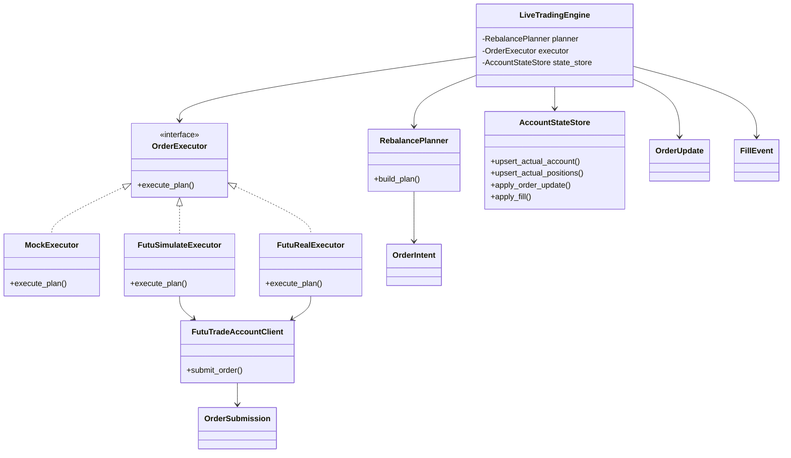
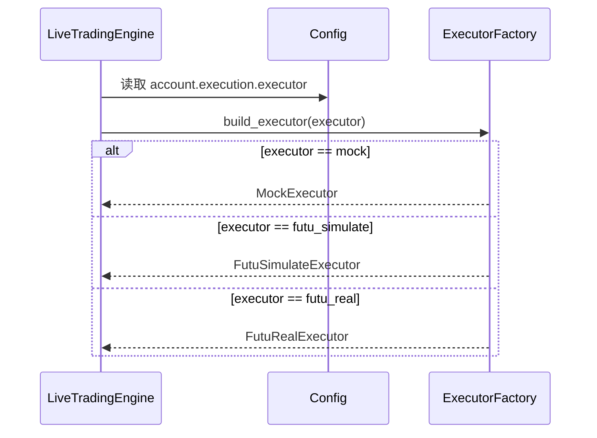
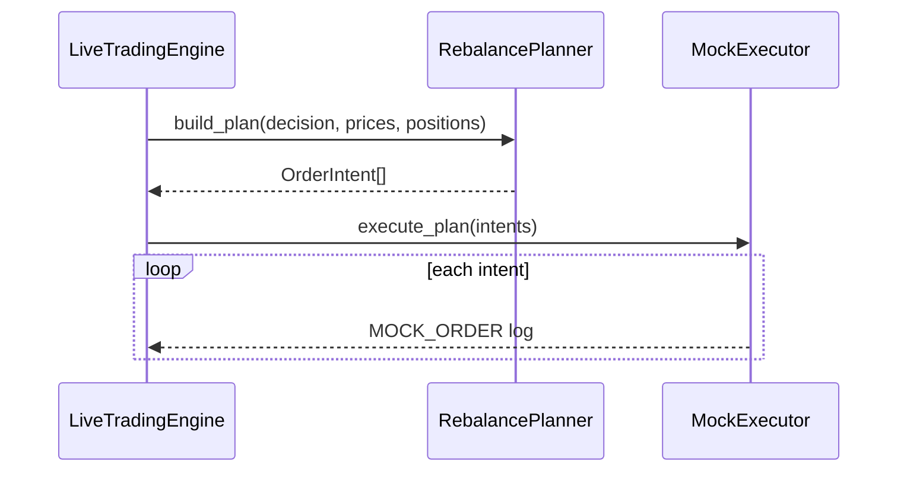
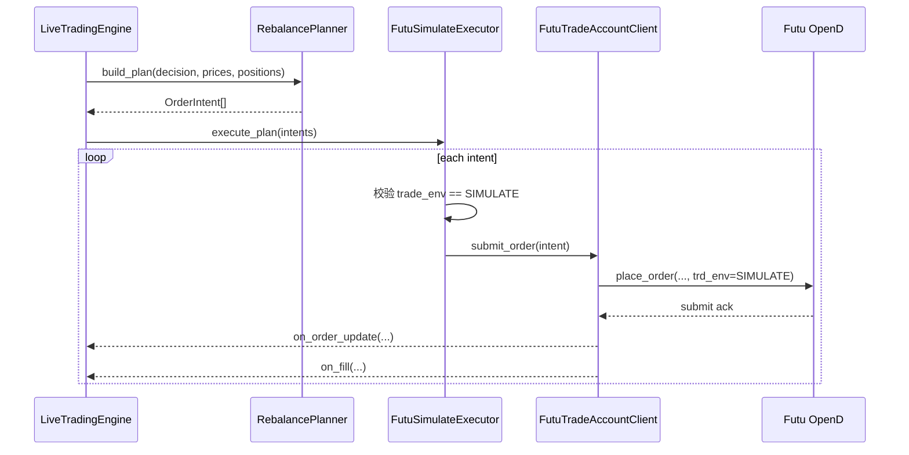
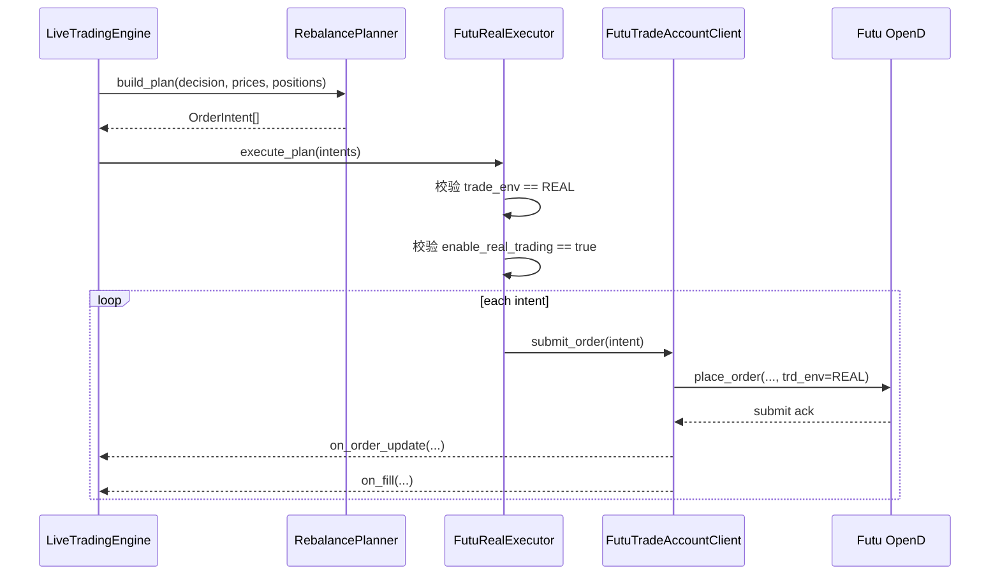

# livetrading 下单执行方案

这份文档只讲一件事：

策略已经能算出“该买什么、卖什么”，下一步下单执行怎么做。

为了简单，执行器只保留 3 种：

- `MockExecutor`
  - 不走 Futu
  - 只打印“准备下什么单”
- `FutuSimulateExecutor`
  - 走 Futu 模拟交易环境
- `FutuRealExecutor`
  - 走 Futu 真实交易环境

旧文档里的 `dry_run`，这里统一改叫 `MockExecutor`。

## 1. 最终要的效果

同一份策略信号，最后只会走下面三选一：

1. `MockExecutor`
2. `FutuSimulateExecutor`
3. `FutuRealExecutor`

不要再搞一个大而全的执行器，再在里面判断：

- `if simulate`
- `if real`
- `if mock`

这样最后一定会乱。

正确做法是：

- 规划层共用一套
- 执行层分成 3 个类

## 2. 三个执行器分别做什么

### 2.1 `MockExecutor`

用途：

- 本地看策略下单结果
- 联调策略和调仓逻辑
- 不连 Futu 也能跑

行为：

- 收到调仓计划
- 逐笔打印订单
- 不提交给 Futu
- 不依赖 `ORDER_PUSH` / `DEAL_PUSH`

### 2.2 `FutuSimulateExecutor`

用途：

- 用 Futu 模拟环境验证真实提单链路
- 验证提交、回报、成交、对账

行为：

- 收到调仓计划
- 调 Futu `place_order(...)`
- `trade_env = SIMULATE`
- 消费 `ORDER_PUSH` / `DEAL_PUSH`

### 2.3 `FutuRealExecutor`

用途：

- 真正连真实账户下单

行为：

- 收到调仓计划
- 调 Futu `place_order(...)`
- `trade_env = REAL`
- 消费 `ORDER_PUSH` / `DEAL_PUSH`
- 比模拟环境多一层安全开关

## 3. 配置怎么写

每个账户配置一个 `execution.executor`：

```json
{
  "account_id": "us_primary",
  "broker": {
    "type": "futu",
    "host": "127.0.0.1",
    "port": 11111,
    "market": "US",
    "trade_env": "SIMULATE",
    "account_index": 0
  },
  "execution": {
    "executor": "futu_simulate",
    "enable_real_trading": false,
    "max_order_notional": 50000.0,
    "max_order_qty": 500
  }
}
```

只需要记住这 3 条：

1. `executor = mock`
   - 不走 Futu
2. `executor = futu_simulate`
   - 必须配 `trade_env = SIMULATE`
3. `executor = futu_real`
   - 必须配 `trade_env = REAL`
   - 必须配 `enable_real_trading = true`

### 3.1 逐字段说明

下面把上面那份配置里的每个字段都单独说明。

#### 顶层字段

- `account_id`
  - 这是这份账户配置在系统里的唯一名字。
  - 主要用途是区分不同交易账户，比如 `us_primary`、`us_backup`。
  - 引擎内部会拿它做日志标识、状态归属标识和字典 key。
  - 它强调的是“系统里的逻辑账户名”，不一定等于券商展示给用户的真实账号字符串。

- `broker`
  - 这一层描述的是“怎么连到券商交易端”。
  - 它回答的是连接地址、市场、交易环境、账户索引这些问题。
  - 简单说，`broker` 决定“连哪里、连哪套账户环境”。

- `execution`
  - 这一层描述的是“信号出来以后到底怎么执行”。
  - 它回答的是走 mock、走模拟提单、还是真实提单，以及执行时的安全限制。
  - 简单说，`execution` 决定“怎么下单”。

#### `broker` 字段

- `broker.type`
  - 示例值：`futu`
  - 表示这份账户配置使用哪一种 broker 适配器。
  - 现在这里写 `futu`，意思是走 Futu 的交易接入实现。
  - 以后如果系统支持别的券商，这里才会出现别的值。

- `broker.host`
  - 示例值：`127.0.0.1`
  - 表示 Futu OpenD 所在的主机地址。
  - `127.0.0.1` 代表 OpenD 跑在本机。
  - 如果 OpenD 跑在另一台机器上，这里就应该改成对应的 IP 或域名。

- `broker.port`
  - 示例值：`11111`
  - 表示 Futu OpenD 的监听端口。
  - 它和 `host` 一起决定交易连接入口。
  - 这个值必须和 OpenD 实际启动时使用的端口一致，否则交易端连不上。

- `broker.market`
  - 示例值：`US`
  - 表示这个账户对应的交易市场。
  - `US` 代表美股市场。
  - 这个字段会影响标的合法性校验、手续费模型选择，以及后续使用哪套市场上下文。

- `broker.trade_env`
  - 示例值：`SIMULATE`
  - 表示 Futu 的交易环境。
  - `SIMULATE` 代表模拟交易环境。
  - `REAL` 代表真实交易环境。
  - 这个字段解决的是“连接哪套 Futu 账户环境”，不是“执行层要不要真的提交订单”。

- `broker.account_index`
  - 示例值：`0`
  - 表示当前连接下要使用第几个交易账户。
  - 如果同一个 OpenD 下面挂了多个账户，系统会靠这个索引去选具体账户。
  - `0` 通常表示第一个账户。
  - 这个值配错了，可能会读错账户，也可能把订单发到错误账户。

#### `execution` 字段

- `execution.executor`
  - 示例值：`futu_simulate`
  - 表示执行器类型，也就是执行层走哪条实现路径。
  - `mock` 的意思是不连接 Futu，只打印计划下什么单。
  - `futu_simulate` 的意思是真的调用 Futu 提单接口，但单子发到模拟环境。
  - `futu_real` 的意思是真的调用 Futu 提单接口，并且单子发到真实环境。

- `execution.enable_real_trading`
  - 示例值：`false`
  - 这是一个显式的安全开关。
  - 它的目的不是选择执行器，而是避免误把真实订单发出去。
  - 当 `executor = futu_real` 时，通常必须显式写成 `true` 才允许继续。
  - 当 `executor = mock` 或 `futu_simulate` 时，这个字段一般保持 `false`。

- `execution.max_order_notional`
  - 示例值：`50000.0`
  - 表示单笔订单允许的最大名义金额上限。
  - 名义金额通常就是 `price * qty`。
  - 例如单笔买单价格是 250 美元、数量是 300 股，那么名义金额就是 75000 美元，会超过这个限制。
  - 这个字段属于执行层风控，不属于策略信号本身。
  - 它的作用是防止配置错误、价格异常或仓位计算错误时一次性打出过大的订单。

- `execution.max_order_qty`
  - 示例值：`500`
  - 表示单笔订单允许的最大股数上限。
  - 不管价格是多少，只要某笔订单数量超过 500 股，就应该被拒绝、截断或者拆单。
  - 这个字段也是执行层风控。
  - 它主要防的是“数量异常大”的错误，不和 `max_order_notional` 重复，二者是两道不同的保护。

### 3.2 最重要的关系

最容易混淆的是下面这两个字段：

- `broker.trade_env`
  - 决定连接 Futu 的哪套环境。
- `execution.executor`
  - 决定执行层走哪一种下单实现。

这两个字段不能互相替代。

例如：

- `trade_env = SIMULATE`
  - 表示连接的是 Futu 模拟环境。
- `executor = futu_simulate`
  - 表示执行层真的会把订单提交到这个模拟环境。

再比如：

- `trade_env = REAL`
  - 表示连接的是真实交易环境。
- `executor = futu_real`
  - 表示执行层真的会往真实环境发单。

所以要把这两个概念分开理解：

- `broker.*`
  - 更偏“连接层”
- `execution.*`
  - 更偏“执行层和风控层”

## 4. 代码结构

建议只保留下面这几个角色：

- `RebalancePlanner`
  - 负责把策略信号变成订单计划
- `OrderExecutor`
  - 执行器接口
- `MockExecutor`
  - 打印订单
- `FutuSimulateExecutor`
  - 提交模拟单
- `FutuRealExecutor`
  - 提交真实单
- `FutuTradeAccountClient`
  - 和 Futu 通信
- `AccountStateStore`
  - 存账户状态、持仓状态、订单状态

最重要的一条：

- `RebalancePlanner` 只负责“该下什么单”
- `Executor` 只负责“怎么下单”

## 5. 必要的数据对象

只保留 4 个核心对象就够了：

### 5.1 `OrderIntent`

表示“准备下的一笔单”。

建议字段：

- `account_id`
- `code`
- `side`
- `qty`
- `limit_price`
- `reason`

### 5.2 `OrderSubmission`

表示“提交结果”。

建议字段：

- `broker_order_id`
- `accepted`
- `message`

### 5.3 `OrderUpdate`

表示“订单状态更新”。

建议字段：

- `broker_order_id`
- `status`
- `dealt_qty`
- `avg_price`

### 5.4 `FillEvent`

表示“成交回报”。

建议字段：

- `broker_order_id`
- `fill_qty`
- `fill_price`

## 6. 类图



这个类图只表达两件事：

- 规划器只有一个
- 执行器有三个

## 7. 时序图

### 7.1 启动时选哪个执行器



### 7.2 `MockExecutor`



### 7.3 `FutuSimulateExecutor`



### 7.4 `FutuRealExecutor`



## 8. 落地顺序

按最简单的顺序做：

1. 先抽出 `RebalancePlanner`
2. 再实现 `MockExecutor`
3. 再实现 `FutuSimulateExecutor`
4. 最后实现 `FutuRealExecutor`

原因很简单：

- `MockExecutor` 最容易验证
- `FutuSimulateExecutor` 跑通以后，才能安心做真实下单
- `FutuRealExecutor` 风险最高，必须最后做

## 9. 一句话总结

不要再写一个万能执行器。

就 3 个执行器：

- `MockExecutor`
- `FutuSimulateExecutor`
- `FutuRealExecutor`

同一套策略规划，接 3 种执行方式，这样最简单，也最不容易看乱。
