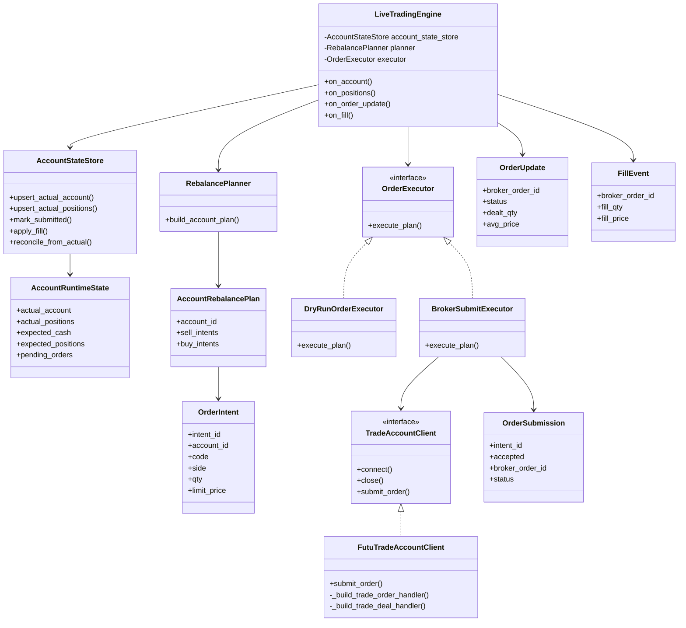
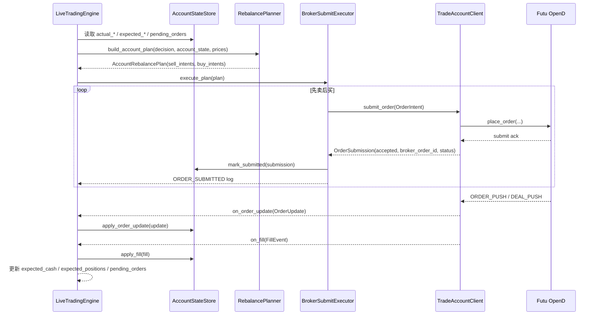
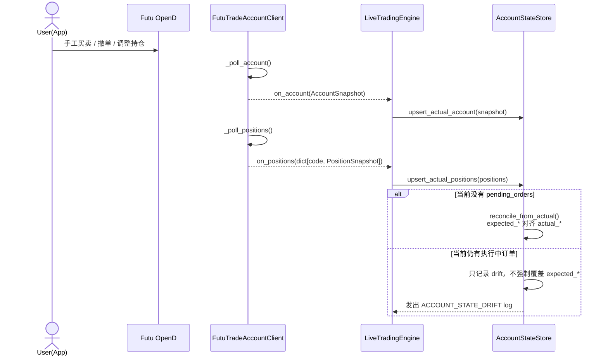
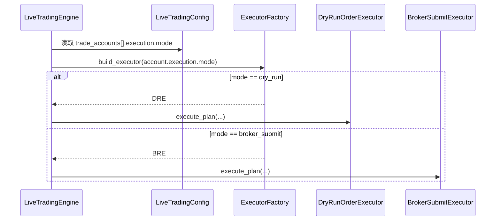

# livetrading 真实下单补齐方案

这份文档讨论如何在当前 `livetrading` 架构上，补齐“从策略信号到真实提交订单”的执行链路。

文档边界：

- 如果你要看当前 mock 行情怎么运行、怎么推 bar，见 [README_livetrading_mock_signal.md](/Users/sean/workspace/backtest-feature-livetrading-startup/docs/README_livetrading_mock_signal.md)
- 如果你要看当前运行链路和时序图，见 [README_livetrading_sequence.md](/Users/sean/workspace/backtest-feature-livetrading-startup/docs/README_livetrading_sequence.md)
- 如果你要看 mock 侧如何继续重构，见 [README_livetrading_mock_refactor.md](/Users/sean/workspace/backtest-feature-livetrading-startup/docs/README_livetrading_mock_refactor.md)

## 1. 当前状态

当前代码已经有：

- 行情输入
  - `mock` / `futu` realtime quote client
- 策略出信号
  - `DualMomentumPoolStrategy`
  - `PortfolioRebalanceDecision`
- 账户状态同步
  - `accinfo_query()`
  - `position_list_query()`
- dry-run 执行
  - 计算目标股数
  - 计算手续费
  - 更新 `shadow_cash` / `shadow_positions`
  - 输出 `DRY_RUN_REBALANCE` / `DRY_RUN_ORDER`

当前代码还没有：

- `TradeAccountClient.submit_order(...)`
- 真实订单模型
  - `OrderIntent`
  - `OrderSubmission`
  - `OrderUpdate`
  - `FillEvent`
- 订单状态机
  - pending / submitted / partially_filled / filled / rejected / canceled
- 基于订单回报的账户状态推进
- 真实下单安全开关

所以现在“不会真实下单”的根本原因不是 `mock` 行情，而是整个执行层还停留在 dry-run。

## 2. 目标

### 2.1 第一阶段目标

- 保持当前策略和配置热更新主流程不变
- 把“该下什么单”和“怎么执行这些单”拆开
- 补齐真实下单链路，但首版只支持：
  - Futu
  - `trade_env=SIMULATE`
  - 限价单
  - long-only
- 保留当前 dry-run 模式，且默认仍是 dry-run

### 2.2 非目标

- 首版不支持自动撤单
- 首版不支持追单 / 改价
- 首版不支持复杂订单类型
  - 市价单
  - 止损单
  - 条件单
- 首版不支持 `trade_env=REAL` 直接放开
- 首版不解决所有“用户在 App 手工交易”场景，只先补齐检测和对账机制

## 3. 设计原则

### 3.1 执行模式必须显式配置

`trade_env=REAL` 只表示“连接真实交易环境”，不能等价于“允许真实下单”。

要真实下单，必须同时满足：

- `execution.mode = broker_submit`
- `broker.trade_env = SIMULATE`

只有等 `SIMULATE` 路径跑稳后，才考虑引入：

- `execution.allow_real_env = true`
- `broker.trade_env = REAL`

### 3.2 规划和执行必须拆开

当前 [livetrading/execution.py](/Users/sean/workspace/backtest-feature-livetrading-startup/livetrading/execution.py) 里的 `DryRunRebalanceExecutor.execute_account_rebalance()` 仍然同时做了两件事：

- 规划
  - 计算组合价值
  - 计算目标股数
  - 生成卖单 / 买单
- 执行
  - 直接修改 `shadow_cash` / `shadow_positions`
  - 直接输出 dry-run 日志

真实下单需要把这两层拆开，否则无法复用同一套“调仓规划”去支持：

- dry-run
- broker submit
- 后续的 paper trading / replay

### 3.3 实际账户状态必须是最终真相源

真实下单以后，不能再简单把 `shadow_cash` / `shadow_positions` 当成“已经成交”的状态。

更合理的规则是：

- `actual_account`
  - 来自 broker 轮询 / push
- `actual_positions`
  - 来自 broker 轮询 / push
- `pending_orders`
  - 记录已提交但未完全落地的订单
- `expected_*`
  - 用于临时预测执行中的状态

最终仍以 `actual_*` 为真相源。

### 3.4 安全默认值优先

默认行为必须仍然是：

- dry-run
- 不真实下单

首版真实下单还必须有额外保险：

- 只允许 `SIMULATE`
- 单笔最大金额限制
- 单笔最大股数限制
- 必须存在参考价
- 必须先完成账户和持仓同步
- 每次提交都打印显式 `ORDER_SUBMITTING` 日志

## 4. 当前缺口

从现有代码看，至少有这几个结构缺口：

### 4.1 `TradeAccountClient` 没有下单接口

[livetrading/trade_accounts/base.py](/Users/sean/workspace/backtest-feature-livetrading-startup/livetrading/trade_accounts/base.py) 里的 `TradeAccountClient` 只有：

- `connect()`
- `close()`

需要扩展成至少支持：

- `submit_order(intent: OrderIntent) -> OrderSubmission`

### 4.2 引擎执行层把“提交订单”和“视为成交”写死在一起

当前 dry-run 在 [livetrading/execution.py](/Users/sean/workspace/backtest-feature-livetrading-startup/livetrading/execution.py) 里会直接：

- 计算 `fee_total`
- 更新 `shadow_cash`
- 更新 `shadow_positions`
- 打 `DRY_RUN_ORDER`

真实下单后，这个顺序必须改成：

- 先生成 `OrderIntent`
- 提交给 broker
- 收到 `OrderSubmission`
- 等待 `ORDER_PUSH` / `DEAL_PUSH`
- 再推进状态

### 4.3 已有 `ORDER_PUSH` / `DEAL_PUSH`，但没有引擎侧消费

[FutuTradeAccountClient](/Users/sean/workspace/backtest-feature-livetrading-startup/livetrading/trade_accounts/futu.py) 已经注册了：

- `_build_trade_order_handler()`
- `_build_trade_deal_handler()`

但现在它们只打日志，没有回调成结构化事件给引擎。

### 4.4 当前账户状态模型不够表达“执行中”

当前 [TradeAccountState](/Users/sean/workspace/backtest-feature-livetrading-startup/livetrading/execution.py) 只有：

- `actual_account`
- `actual_positions`
- `shadow_cash`
- `shadow_positions`

这不足以表达：

- 某单已提交但未成交
- 某单部分成交
- 实际账户被用户在 App 手工改动
- 本地期望状态与实际状态漂移

## 5. 目标配置方案

建议在每个 `trade_accounts[]` 下新增独立的 `execution` 段，而不是把执行开关塞进 `broker`：

```json
{
  "account_id": "sim_primary",
  "broker": {
    "type": "futu",
    "host": "127.0.0.1",
    "port": 11111,
    "market": "US",
    "trade_env": "SIMULATE",
    "account_index": 0
  },
  "execution": {
    "mode": "dry_run",
    "order_type": "limit",
    "allow_real_env": false,
    "buy_limit_price_offset_bps": 0.0,
    "sell_limit_price_offset_bps": 0.0,
    "max_order_notional": 50000.0,
    "max_order_qty": 500,
    "require_fresh_account_state": true
  }
}
```

建议语义：

- `mode`
  - `dry_run`
  - `broker_submit`
- `allow_real_env`
  - 仅当 `trade_env=REAL` 时需要显式为 `true`
- `buy_limit_price_offset_bps`
  - 买单限价在参考价基础上向上偏移多少基点
- `sell_limit_price_offset_bps`
  - 卖单限价在参考价基础上向下偏移多少基点
- `require_fresh_account_state`
  - 如果账户资金或持仓太久没同步，拒绝提交真实订单

## 6. 目标模块划分

建议在现有 [livetrading/execution.py](/Users/sean/workspace/backtest-feature-livetrading-startup/livetrading/execution.py) 的基础上，继续补这些模块：

```text
livetrading/
  execution_models.py
  execution_planner.py
  execution.py
  account_state.py
```

建议职责：

- `execution_models.py`
  - `OrderIntent`
  - `OrderSubmission`
  - `OrderUpdate`
  - `FillEvent`
  - `PendingOrder`
- `execution_planner.py`
  - `AccountRebalancePlan`
  - `RebalancePlanner`
- `execution.py`
  - 现有 `DryRunRebalanceExecutor`
  - 后续可继续拆成 `OrderExecutor` / `DryRunOrderExecutor` / `BrokerSubmitExecutor`
- `account_state.py`
  - `AccountRuntimeState`
  - `AccountStateStore`
  - 对账 / 漂移检测逻辑

现有文件的主要改动方向：

- [livetrading/config.py](/Users/sean/workspace/backtest-feature-livetrading-startup/livetrading/config.py)
  - 新增 `ExecutionConfig`
- [livetrading/trade_accounts/base.py](/Users/sean/workspace/backtest-feature-livetrading-startup/livetrading/trade_accounts/base.py)
  - 扩展 `TradeAccountClient`
  - 扩展 `TradeAccountEventSink`
- [livetrading/trade_accounts/futu.py](/Users/sean/workspace/backtest-feature-livetrading-startup/livetrading/trade_accounts/futu.py)
  - 在 `FutuTradeAccountClient` 里实现 `submit_order(...)`
- [livetrading/engine.py](/Users/sean/workspace/backtest-feature-livetrading-startup/livetrading/engine.py)
  - 现在已经不再自己硬编码 dry-run 执行
  - 改成协调 planner / executor / state store

## 7. 关键数据模型

建议新增这些核心对象：

### 7.1 `OrderIntent`

表示“引擎打算提交什么单”，但还没发给 broker。

建议字段：

- `intent_id`
- `account_id`
- `signal_time`
- `code`
- `side`
- `qty`
- `reference_price`
- `limit_price`
- `order_type`
- `reason`
- `metadata`

### 7.2 `OrderSubmission`

表示“broker 已经收到提交请求”的返回结果。

建议字段：

- `intent_id`
- `accepted`
- `broker_order_id`
- `submitted_qty`
- `submitted_price`
- `status`
  - `submitted`
  - `rejected`
- `message`
- `raw`

### 7.3 `OrderUpdate`

表示订单状态更新。

建议字段：

- `account_id`
- `broker_order_id`
- `code`
- `side`
- `status`
  - `submitted`
  - `partially_filled`
  - `filled`
  - `canceled`
  - `rejected`
- `submitted_qty`
- `dealt_qty`
- `avg_price`
- `updated_at`
- `raw`

### 7.4 `FillEvent`

表示成交事件。

建议字段：

- `account_id`
- `broker_order_id`
- `code`
- `side`
- `fill_qty`
- `fill_price`
- `filled_at`
- `raw`

### 7.5 `AccountRuntimeState`

建议把账户运行态扩成：

- `actual_account`
- `actual_positions`
- `expected_cash`
- `expected_positions`
- `pending_orders`
- `last_account_sync_at`
- `last_position_sync_at`
- `last_reconciled_at`

说明：

- `actual_*`
  - broker 真相源
- `expected_*`
  - 本地执行期望状态
- `pending_orders`
  - 已提交但尚未完成的订单

## 8. 类图



## 9. 关键时序图

### 9.1 `broker_submit` 模式下的真实提单链路



### 9.2 用户在 App 手工操作后的对账链路



### 9.3 启动时按执行模式选择 executor



## 10. 分阶段落地方案

### Phase 0: 纯重构，不改外部行为

- 提取 `RebalancePlanner`
- 提取 `DryRunOrderExecutor`
- 提取 `AccountStateStore`
- `LiveTradingEngine` 改成协调者

验收标准：

- 当前 `DRY_RUN_REBALANCE` / `DRY_RUN_ORDER` 行为不变
- 现有测试全部继续通过

### Phase 1: 补齐订单模型和接口

- 新增：
  - `OrderIntent`
  - `OrderSubmission`
  - `OrderUpdate`
  - `FillEvent`
- `TradeAccountClient` 增加 `submit_order(...)`
- `TradeAccountEventSink` 增加：
  - `on_order_update(...)`
  - `on_fill(...)`

验收标准：

- 可以用 fake client 覆盖 submit / update / fill 路径
- 不接真实 Futu 也能在单元测试里跑通状态机

### Phase 2: 接 Futu `SIMULATE` 真实提单

- `FutuTradeAccountClient.submit_order(...)`
- 把 `ORDER_PUSH` / `DEAL_PUSH` 改成结构化回调
- 新增 `BrokerSubmitExecutor`

验收标准：

- 在 `SIMULATE` 账户能实际提交单子
- 日志能看到：
  - `ORDER_SUBMITTED`
  - `ORDER_UPDATE`
  - `FILL_APPLIED`

### Phase 3: 对账与漂移处理

- `AccountStateStore.reconcile_from_actual()`
- 检测：
  - 用户在 App 手工改仓
  - 本地 expected 和实际持仓漂移
- 先只做：
  - 记录 drift
  - 在无 pending 订单时自动对齐

验收标准：

- 手工交易后系统不会误以为本地 expected 就是真实状态
- drift 会被显式日志标出

### Phase 4: 放开 `REAL`

前提：

- `SIMULATE` 已稳定
- drift / pending / fill 流程跑顺
- 风控项都已落地

再考虑增加：

- `execution.allow_real_env = true`
- `broker.trade_env = REAL`

## 11. 最小可交付版本建议

如果只做最小、可控、尽快落地的一版，我建议范围限定为：

- 只支持 Futu
- 只支持 `trade_env=SIMULATE`
- 只支持限价单
- 只支持股票
- 只支持 long-only
- 不做撤单
- 不做追单
- 不做自动重试
- 不做复杂风控

这个版本的目标不是“完整交易系统”，而是：

- 证明当前策略链路可以从 `PortfolioRebalanceDecision`
- 走到 `submit_order(...)`
- 再走回 `ORDER_PUSH` / `DEAL_PUSH`
- 最终闭环到账户状态

## 12. 建议的实施顺序

1. 先抽 `RebalancePlanner`
2. 再抽 `DryRunOrderExecutor`
3. 再引入 `AccountStateStore`
4. 再补订单模型和 `submit_order(...)`
5. 再接 `BrokerSubmitExecutor`
6. 最后才考虑 `REAL`

原因很简单：

- 先把 dry-run 的“规划”和“执行”拆开，后面的真实下单才有稳定落点
- 先在 `SIMULATE` 跑通，再谈 `REAL`
- 先让状态机和对账逻辑成立，再谈高级执行策略
