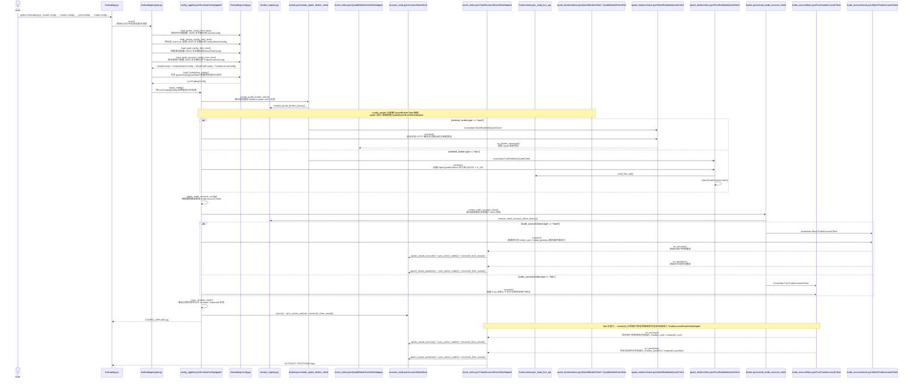
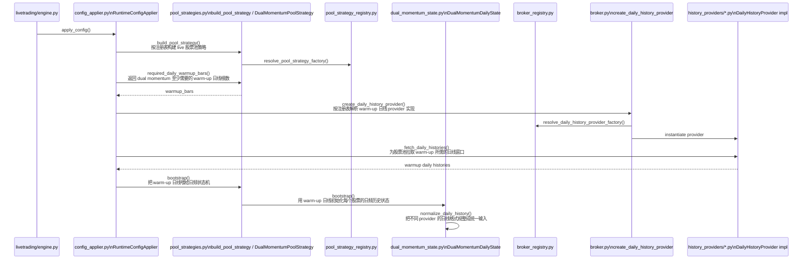
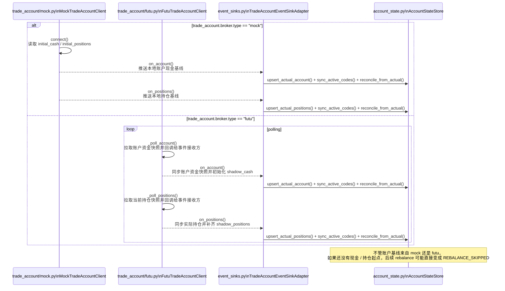
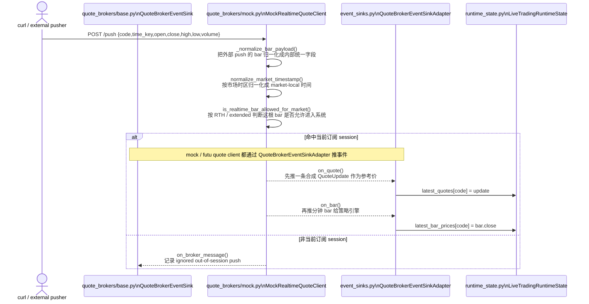
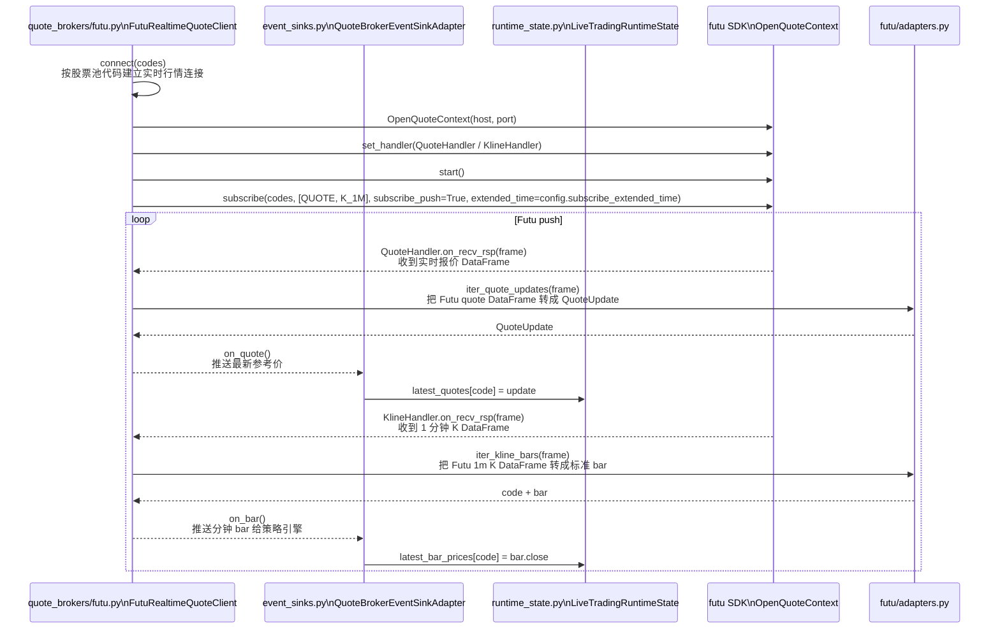
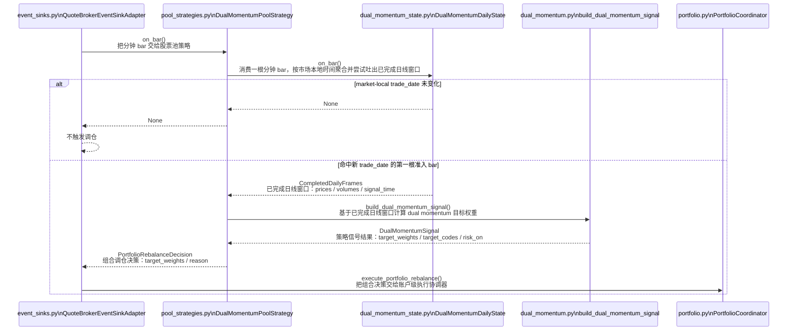
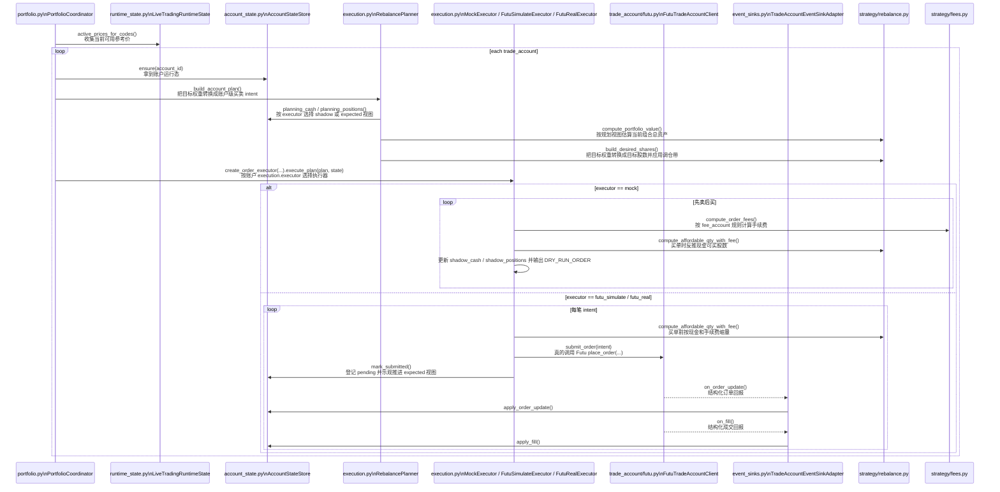

# `livetrading.py` 实盘链路时序图

这份文档针对 `livetrading` 的实盘链路，主要整理关键代码文件之间的时序关系。

下面的启动命令只是为了给时序图提供一个具体入口示例，不代表本文只讨论 `mock` 行情模式。

等价的包入口 `./.venv/bin/python -m livetrading ...` 也可用；本文继续沿用根目录 `livetrading.py` 写法，方便和现有脚本命令保持一致。

如果你要看执行器设计、`mock / futu_simulate / futu_real` 三种模式的差异，见 [README_livetrading_real_order_plan.md](../docs/README_livetrading_real_order_plan.md)。

示例命令：

```bash
./.venv/bin/python livetrading.py \
  --quote-config config/livetrading.quote.mock.sample.json \
  --history-config config/livetrading.history.local.sample.json \
  --pool-config config/livetrading.pool.sample.json \
  --trade-config config/livetrading.trade_account.mock.sample.json
```

当前仓库里的 `config/livetrading.trade_account.mock.sample.json` 已把 `order_session` 设成 `ETH`。所以如果 quote 侧也走 mock，美股示例下 `04:00` 的盘前分钟 bar 可以通过实时行情入口并触发换日；如果改回 `RTH`，同样的 `04:00 /push` 会在 quote broker 入口被忽略。

下面的时序图主要聚焦这些文件之间的交互：

- [livetrading.py](../livetrading.py)
- [livetrading/engine.py](../livetrading/engine.py)
- [livetrading/runtime_state.py](../livetrading/runtime_state.py)
- [livetrading/config_applier.py](../livetrading/config_applier.py)
- [livetrading/event_sinks.py](../livetrading/event_sinks.py)
- [livetrading/portfolio.py](../livetrading/portfolio.py)
- [livetrading/pool_strategy_registry.py](../livetrading/pool_strategy_registry.py)
- [livetrading/config.py](../livetrading/config.py)
- [livetrading/broker_registry.py](../livetrading/broker_registry.py)
- [livetrading/broker.py](../livetrading/broker.py)
- [livetrading/execution.py](../livetrading/execution.py)
- [livetrading/futu/adapters.py](../livetrading/futu/adapters.py)
- [livetrading/futu/runtime.py](../livetrading/futu/runtime.py)
- [livetrading/history_providers/base.py](../livetrading/history_providers/base.py)
- [livetrading/history_providers/common.py](../livetrading/history_providers/common.py)
- [livetrading/market_hours.py](../livetrading/market_hours.py)
- [livetrading/history_providers/local.py](../livetrading/history_providers/local.py)
- [livetrading/history_providers/cached.py](../livetrading/history_providers/cached.py)
- [livetrading/history_providers/polygon.py](../livetrading/history_providers/polygon.py)
- [livetrading/history_providers/futu.py](../livetrading/history_providers/futu.py)
- [livetrading/quote_brokers/base.py](../livetrading/quote_brokers/base.py)
- [livetrading/quote_brokers/mock.py](../livetrading/quote_brokers/mock.py)
- [livetrading/quote_brokers/futu.py](../livetrading/quote_brokers/futu.py)
- [livetrading/trade_account/base.py](../livetrading/trade_account/base.py)
- [livetrading/trade_account/futu.py](../livetrading/trade_account/futu.py)
- [livetrading/trade_account/mock.py](../livetrading/trade_account/mock.py)
- [livetrading/pool_strategies.py](../livetrading/pool_strategies.py)
- [strategy/dual_momentum_state.py](../strategy/dual_momentum_state.py)
- [strategy/dual_momentum.py](../strategy/dual_momentum.py)
- [strategy/rebalance.py](../strategy/rebalance.py)
- [strategy/fees.py](../strategy/fees.py)

下面 Mermaid 里的方法说明，和代码里对应方法的中文注释保持一致，方便你对着图直接跳代码。

当前实现里，`livetrading/engine.py` 已经收缩成装配层：

- 配置 diff / 连接重建 / warm-up 由 `livetrading/config_applier.py` 负责
- quote / trade account 回调由 `livetrading/event_sinks.py` 负责
- 组合决策拆单和执行器分发由 `livetrading/portfolio.py` 负责
- quote/history/trade 的内建实现由各自子包注册到 `livetrading/broker_registry.py`，`livetrading/broker.py` 只保留 facade
- live pool strategy 的内建实现由 `livetrading/pool_strategies.py` 注册到 `livetrading/pool_strategy_registry.py`

下面的 Mermaid 图会把 `config_applier.py`、`event_sinks.py`、`portfolio.py` 明确展开；`ENG` 只表示 `LiveTradingEngine` 的主循环和兼容代理入口。

## 1. 启动 + 配置加载 + 运行时协作者装配



这一步的关键点：

- `quote_brokers/base.py` 只定义 `QuoteBrokerClient` / `QuoteBrokerEventSink` 抽象
- [livetrading/engine.py](../livetrading/engine.py) 通过这个抽象持有 realtime quote client
- 当前示例命令走的是 `mock` 分支，但工厂同时也能返回 [livetrading/quote_brokers/futu.py](../livetrading/quote_brokers/futu.py) 里的 `FutuRealtimeQuoteClient`
- 配置文件读取、broker 初始化、trade account 连接都在这一段完成
- warm-up 本身单独放到下一张图看

## 2. warm-up



这一步的关键点：

- 策略 warm-up 仍然走 `history_broker`
- warm-up 的输出是“已完成日线窗口”，不是直接下单指令
- 账户基线怎么进入运行态，在下一张图里单独看

## 3. 账户基线进入运行态，对后续调仓的影响



这里要分开理解：

- 如果 trade account 走 `mock`，账户基线来自本地配置，不需要 Futu。
- 如果 trade account 走 `futu`，账户基线来自 Futu 同步。

真正必须成立的条件不是“必须连 Futu”，而是“系统在调仓前必须先拿到一版现金和持仓基线”。

## 4. 实时行情入口

这一节只讨论“分钟行情怎么进入实时事件入口”。

`4.1` 和 `4.2` 是两种可替换的实时行情入口，运行时按 `realtime_broker.type` 二选一：

- `type=mock` 时走 `4.1`
- `type=futu` 时走 `4.2`

它们不是说同一次启动里两个都要启用。

### 4.1 mock 接收 `/push` 并把行情送进实时事件入口



当前这份 mock 样例配置是 `ETH`，所以美股 `2026-03-13 04:00:00` 这类盘前 bar 会通过这里的准入检查；如果你把 `order_session` 改成 `RTH`，同样的 push 会在这一步被拦下，不会再进入 `on_bar(...)`。

### 4.2 futu 订阅实盘股价并把推送送进实时事件入口



## 5. 分钟 bar 进入策略层，并在换日时决定是否出信号



这里的 `trade_date` 不是直接取输入 `time_key.date()`。`DualMomentumDailyState` 会先把 bar 归一化到市场本地时区，再通过 `market_trade_date_for_timestamp(...)` 判断这根 bar 属于哪个交易日。这样像 `2026-03-13 00:30:00+00:00` 这种时间，在美股场景下会先换算成纽约时间 `2026-03-12 19:30:00`，不会被误判成 `2026-03-13` 的新交易日。

## 6. 账户级执行协调器按账户选择执行器并执行调仓



这里最重要的时序关系是：

1. 实时行情入口按 `realtime_broker.type` 二选一：要么是 `mock /push`，要么是 Futu `QUOTE + K_1M subscribe push`；两者在进入 `QuoteBrokerEventSinkAdapter` 之前都有“bar 准入”这一步。`mock` 用 [livetrading/market_hours.py](../livetrading/market_hours.py) 在本地按市场时区和 `RTH / extended` 过滤，Futu 则通过 `subscribe(..., extended_time=...)` 把准入语义交给 SDK。
2. 策略层只有在“market-local trade_date 变化后的第一根准入分钟 bar”到来时，才会从 `DualMomentumDailyState` 吐出已完成日线窗口。当前这份美股 mock 样例是 `ETH`，所以 `04:00` 的首根盘前 bar 就可以触发；如果配置成 `RTH`，则要等到 `09:30` 之后的首根 bar。
3. `build_dual_momentum_signal(...)` 用这份已完成日线窗口生成目标权重。
4. `QuoteBrokerEventSinkAdapter` 拿到 `PortfolioRebalanceDecision` 后，会调用 `PortfolioCoordinator`，再按账户读取 `execution.executor`，选择 `mock / futu_simulate / futu_real` 三种执行路径之一。
5. `mock` 会继续维护 `shadow_cash / shadow_positions` 并输出 `DRY_RUN_*` 日志；`futu_simulate / futu_real` 会在提交买单前先按 `expected_cash` 和手续费把数量收缩到可买范围，再走真实 `place_order(...)`，随后通过 `ORDER_PUSH / DEAL_PUSH` 按最终成交数量、均价和手续费估算纠偏，并等待真实账户快照把 `pending_orders` 清掉。

## 7. 文件职责对照

- [livetrading.py](../livetrading.py)
  - CLI 入口，只负责启动和停止 engine
- [livetrading/config.py](../livetrading/config.py)
  - 解析 quote / history / pool / trade 四份配置，拼成 `LiveTradingConfig`
- [livetrading/runtime_state.py](../livetrading/runtime_state.py)
  - 统一存放当前配置快照、quote broker、history provider、trade account clients、pool strategy 和最新价格缓存
- [livetrading/config_applier.py](../livetrading/config_applier.py)
  - 把 `LiveTradingConfig` 应用成具体运行时资源
  - 负责配置 diff、连接重建、history warm-up、strategy bootstrap、trade account client 增删重连和 shadow state 同步
- [livetrading/event_sinks.py](../livetrading/event_sinks.py)
  - 行情和账户事件接收层
  - `QuoteBrokerEventSinkAdapter` 负责更新最新价格并驱动策略 / 调仓协调器
  - `TradeAccountEventSinkAdapter` 负责把账户、持仓、订单、成交事件收口到 `AccountStateStore`
- [livetrading/portfolio.py](../livetrading/portfolio.py)
  - 组合级调仓协调层
  - 把一次 `PortfolioRebalanceDecision` 展开成多个账户计划，并把账户计划交给执行器
- [livetrading/pool_strategy_registry.py](../livetrading/pool_strategy_registry.py)
  - live pool strategy 的注册表边界
  - 配置解析和 `build_pool_strategy()` 都通过它查当前支持的策略名
- [livetrading/broker_registry.py](../livetrading/broker_registry.py)
  - quote broker / history provider / trade account client 的注册表边界
  - 内建类型由各自基础设施子包注册，配置校验也从这里读支持类型
- [livetrading/broker.py](../livetrading/broker.py)
  - facade / factory 层
  - 提供：
    - quote broker factory
    - history provider factory
    - trade account client factory
- [livetrading/execution.py](../livetrading/execution.py)
  - 调仓规划和执行器选择层
  - 提供 `RebalancePlanner`、`MockExecutor`、`FutuSimulateExecutor`、`FutuRealExecutor`
- [livetrading/account_state.py](../livetrading/account_state.py)
  - 账户运行态存储层
  - 提供 `AccountRuntimeState`、`PendingOrder`、`AccountStateStore`
- [livetrading/futu/runtime.py](../livetrading/futu/runtime.py)
  - 提供共享的 Futu SDK 装载逻辑
  - 负责 `.futu_runtime` 的运行时环境准备
- [livetrading/futu/adapters.py](../livetrading/futu/adapters.py)
  - 负责把 Futu DataFrame 转成 `QuoteUpdate` 和标准化分钟 `bar`
- [livetrading/history_providers/base.py](../livetrading/history_providers/base.py)
  - 定义 `DailyHistoryProvider` 抽象
- [livetrading/history_providers/common.py](../livetrading/history_providers/common.py)
  - history provider 的共享兼容层
  - 复用并转发 `market_hours.py` 里的市场日历、交易日和常量定义
- [livetrading/market_hours.py](../livetrading/market_hours.py)
  - 统一的市场时区 / 交易日 / RTH vs extended 准入逻辑
  - 被 history provider、mock quote broker、strategy state 共用
- [livetrading/history_providers/local.py](../livetrading/history_providers/local.py)
  - 本地日线 warm-up 实现
- [livetrading/history_providers/cached.py](../livetrading/history_providers/cached.py)
  - “本地缓存 + 远端回源” 的 warm-up 基类
- [livetrading/history_providers/polygon.py](../livetrading/history_providers/polygon.py)
  - Polygon 日线 warm-up 实现
- [livetrading/history_providers/futu.py](../livetrading/history_providers/futu.py)
  - Futu 日线 warm-up 实现
- [livetrading/quote_brokers/base.py](../livetrading/quote_brokers/base.py)
  - 定义 realtime quote 抽象边界：
    - `QuoteBrokerClient`
    - `QuoteBrokerEventSink`
- [livetrading/quote_brokers/mock.py](../livetrading/quote_brokers/mock.py)
  - mock 实时行情入口
  - 负责 `/health` / `/push`、bar 归一化、按 session 过滤、合成 quote、再推 bar
- [livetrading/quote_brokers/futu.py](../livetrading/quote_brokers/futu.py)
  - Futu 实时行情实现
  - 负责 `OpenQuoteContext`、订阅管理、`extended_time` 透传、handler 挂接
- [livetrading/trade_account/base.py](../livetrading/trade_account/base.py)
  - 定义 `TradeAccountClient` / `TradeAccountEventSink` 抽象
- [livetrading/trade_account/futu.py](../livetrading/trade_account/futu.py)
  - Futu 交易账户实现
  - 负责账户轮询、持仓轮询、`ORDER_PUSH` / `DEAL_PUSH`
- [livetrading/engine.py](../livetrading/engine.py)
  - 实盘主控器，只负责主循环、配置文件 watcher、首次加载和兼容代理方法
- [livetrading/pool_strategies.py](../livetrading/pool_strategies.py)
  - live 侧股票池策略适配层
  - 定义 `PoolLiveStrategy` 抽象，并注册内建 `dual_momentum`
- [strategy/dual_momentum_state.py](../strategy/dual_momentum_state.py)
  - 把分钟 bar 增量聚合成“已完成日线窗口”
  - `trade_date` 按市场本地时间计算，并在换日第一根准入 bar 吐出 completed window
- [strategy/dual_momentum.py](../strategy/dual_momentum.py)
  - 纯信号逻辑，输出 `target_weights`
- [strategy/rebalance.py](../strategy/rebalance.py)
  - 共享的目标股数、可买数量、调仓带计算
- [strategy/fees.py](../strategy/fees.py)
  - 共享的手续费计算

## 8. 一句话总结

这条实盘链路本质上是：

```text
quote client / trade account client / history provider
-> broker_registry.py + broker.py facade
-> engine.py + config_applier.py + runtime_state.py
-> event_sinks.py + portfolio.py
-> pool_strategy_registry.py + pool_strategies.py facade
-> pool_strategies.py
-> dual_momentum_state.py + dual_momentum.py
-> account_state.py + execution.py
-> strategy/rebalance.py + strategy/fees.py
-> DRY_RUN_ORDER / ORDER_SUBMITTED / ORDER_UPDATE / FILL / ACCOUNT / POSITIONS logs
```

## 9. 相关文档

- 如果你要看怎么启动 mock 并复现 `BUY -> SELL -> BUY`，见 [README_livetrading_mock_signal.md](../docs/README_livetrading_mock_signal.md)
- 如果你要看当前执行层结构和配置规则，见 [README_livetrading_real_order_plan.md](../docs/README_livetrading_real_order_plan.md)
