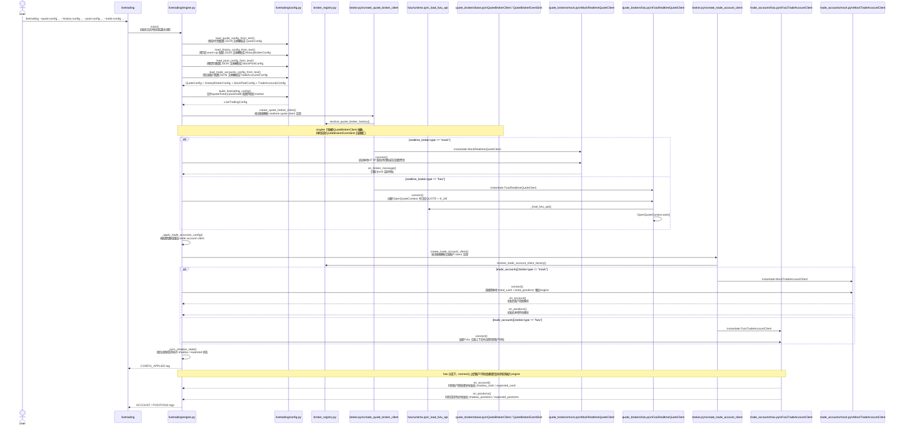
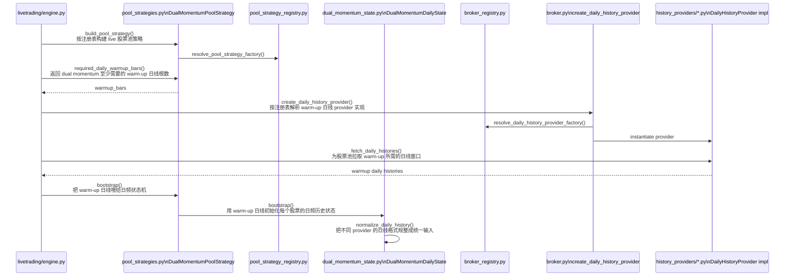
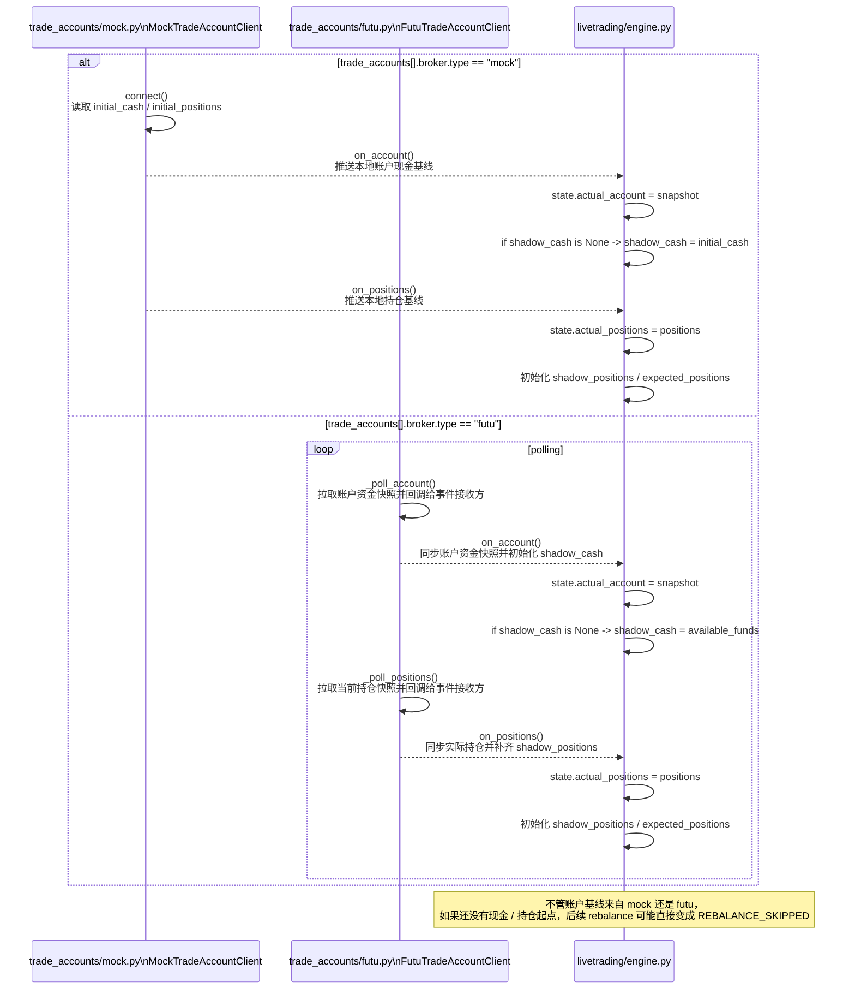
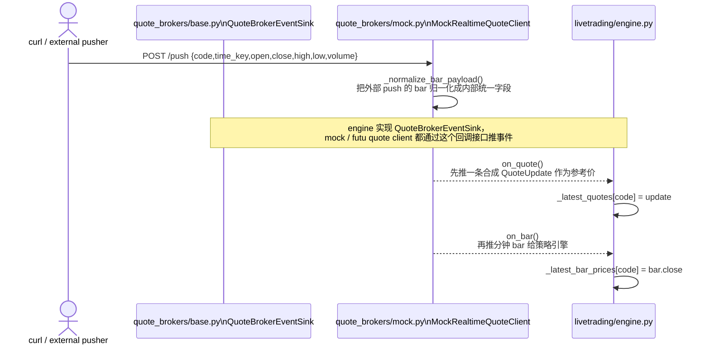
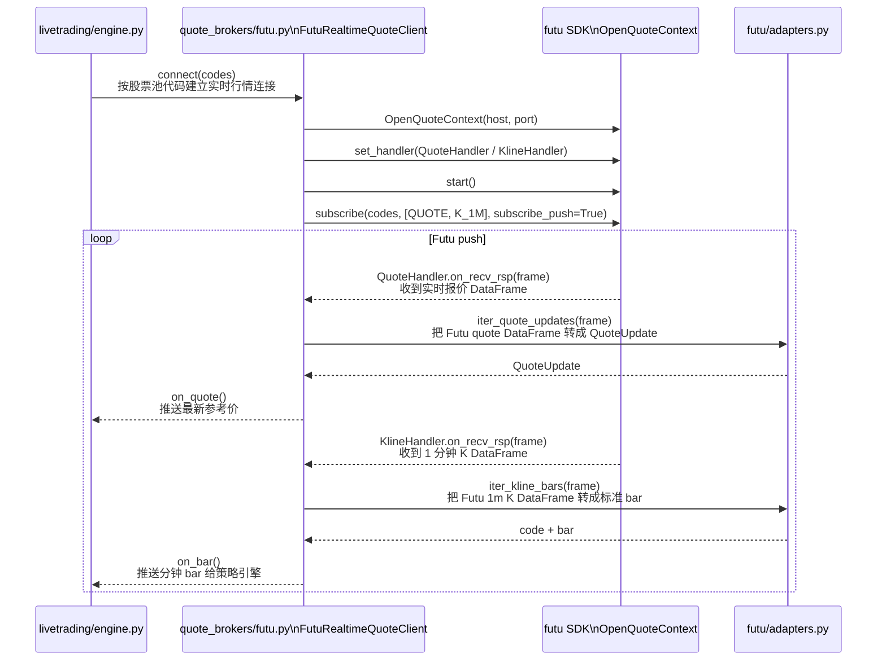
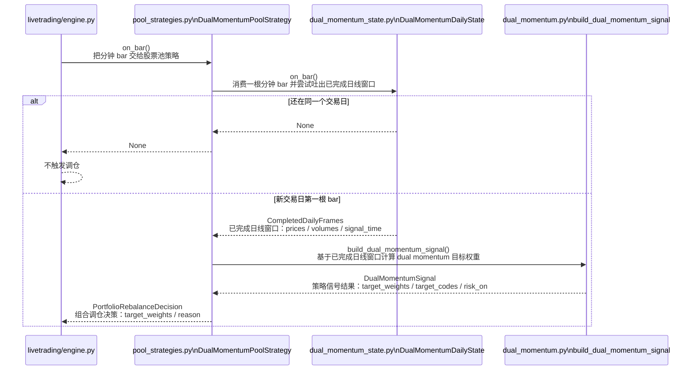
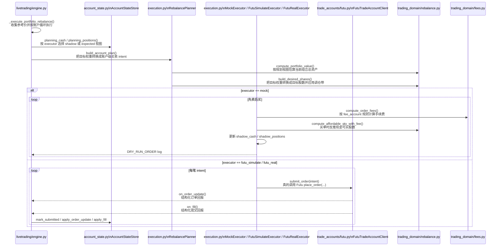

# `livetrading` 实盘链路时序图

这份文档针对 `livetrading` 的实盘链路，主要整理关键代码文件之间的时序关系。

下面的启动命令只是为了给时序图提供一个具体入口示例，不代表本文只讨论 `mock` 行情模式。

推荐使用安装后的包入口 `livetrading ...`（等价于 `python -m livetrading ...`）。
根目录 `livetrading.py` 目前保留为兼容 shim。

如果你要看执行器设计、`mock / futu_simulate / futu_real` 三种模式的差异，见 [README_livetrading_real_order_plan.md](/Users/sean/workspace/backtest-feature-livetrading-startup/docs/README_livetrading_real_order_plan.md)。

示例命令：

```bash
livetrading \
  --quote-config config/livetrading.quote.mock.sample.json \
  --history-config config/livetrading.history.local.sample.json \
  --pool-config config/livetrading.pool.sample.json \
  --trade-config config/livetrading.trade_accounts.mock.sample.json
```

下面的时序图主要聚焦这些文件之间的交互：

- [livetrading.py](/Users/sean/workspace/backtest-feature-livetrading-startup/livetrading.py)
- [livetrading/engine.py](/Users/sean/workspace/backtest-feature-livetrading-startup/livetrading/engine.py)
- [livetrading/runtime_state.py](/Users/sean/workspace/backtest-feature-livetrading-startup/livetrading/runtime_state.py)
- [livetrading/config_applier.py](/Users/sean/workspace/backtest-feature-livetrading-startup/livetrading/config_applier.py)
- [livetrading/event_sinks.py](/Users/sean/workspace/backtest-feature-livetrading-startup/livetrading/event_sinks.py)
- [livetrading/portfolio.py](/Users/sean/workspace/backtest-feature-livetrading-startup/livetrading/portfolio.py)
- [livetrading/pool_strategy_registry.py](/Users/sean/workspace/backtest-feature-livetrading-startup/livetrading/pool_strategy_registry.py)
- [livetrading/config.py](/Users/sean/workspace/backtest-feature-livetrading-startup/livetrading/config.py)
- [livetrading/broker_registry.py](/Users/sean/workspace/backtest-feature-livetrading-startup/livetrading/broker_registry.py)
- [livetrading/broker.py](/Users/sean/workspace/backtest-feature-livetrading-startup/livetrading/broker.py)
- [livetrading/execution.py](/Users/sean/workspace/backtest-feature-livetrading-startup/livetrading/execution.py)
- [livetrading/futu/adapters.py](/Users/sean/workspace/backtest-feature-livetrading-startup/livetrading/futu/adapters.py)
- [livetrading/futu/runtime.py](/Users/sean/workspace/backtest-feature-livetrading-startup/livetrading/futu/runtime.py)
- [livetrading/history_providers/base.py](/Users/sean/workspace/backtest-feature-livetrading-startup/livetrading/history_providers/base.py)
- [livetrading/history_providers/common.py](/Users/sean/workspace/backtest-feature-livetrading-startup/livetrading/history_providers/common.py)
- [livetrading/history_providers/local.py](/Users/sean/workspace/backtest-feature-livetrading-startup/livetrading/history_providers/local.py)
- [livetrading/history_providers/cached.py](/Users/sean/workspace/backtest-feature-livetrading-startup/livetrading/history_providers/cached.py)
- [livetrading/history_providers/polygon.py](/Users/sean/workspace/backtest-feature-livetrading-startup/livetrading/history_providers/polygon.py)
- [livetrading/history_providers/futu.py](/Users/sean/workspace/backtest-feature-livetrading-startup/livetrading/history_providers/futu.py)
- [livetrading/quote_brokers/base.py](/Users/sean/workspace/backtest-feature-livetrading-startup/livetrading/quote_brokers/base.py)
- [livetrading/quote_brokers/mock.py](/Users/sean/workspace/backtest-feature-livetrading-startup/livetrading/quote_brokers/mock.py)
- [livetrading/quote_brokers/futu.py](/Users/sean/workspace/backtest-feature-livetrading-startup/livetrading/quote_brokers/futu.py)
- [livetrading/trade_accounts/base.py](/Users/sean/workspace/backtest-feature-livetrading-startup/livetrading/trade_accounts/base.py)
- [livetrading/trade_accounts/futu.py](/Users/sean/workspace/backtest-feature-livetrading-startup/livetrading/trade_accounts/futu.py)
- [livetrading/trade_accounts/mock.py](/Users/sean/workspace/backtest-feature-livetrading-startup/livetrading/trade_accounts/mock.py)
- [livetrading/pool_strategies.py](/Users/sean/workspace/backtest-feature-livetrading-startup/livetrading/pool_strategies.py)
- [strategy/dual_momentum_state.py](/Users/sean/workspace/backtest-feature-livetrading-startup/strategy/dual_momentum_state.py)
- [strategy/dual_momentum.py](/Users/sean/workspace/backtest-feature-livetrading-startup/strategy/dual_momentum.py)
- [trading_domain/rebalance.py](/Users/sean/workspace/backtest-feature-livetrading-startup/trading_domain/rebalance.py)
- [trading_domain/fees.py](/Users/sean/workspace/backtest-feature-livetrading-startup/trading_domain/fees.py)

下面 Mermaid 里的方法说明，和代码里对应方法的中文注释保持一致，方便你对着图直接跳代码。

当前实现里，`livetrading/engine.py` 已经收缩成装配层：

- 配置 diff / 连接重建 / warm-up 由 `livetrading/config_applier.py` 负责
- quote / trade account 回调由 `livetrading/event_sinks.py` 负责
- 组合决策拆单和执行器分发由 `livetrading/portfolio.py` 负责
- quote/history/trade 的内建实现由各自子包注册到 `livetrading/broker_registry.py`，`livetrading/broker.py` 只保留 facade
- live pool strategy 的内建实现由 `livetrading/pool_strategies.py` 注册到 `livetrading/pool_strategy_registry.py`

下面的 Mermaid 图仍用 `ENG` 表示整体入口，便于阅读；对应代码时，要连同这些协作者一起看。

## 1. 启动 + 配置加载 + quote / history / pool / trade client 选择



这一步的关键点：

- `quote_brokers/base.py` 只定义 `QuoteBrokerClient` / `QuoteBrokerEventSink` 抽象
- [livetrading/engine.py](/Users/sean/workspace/backtest-feature-livetrading-startup/livetrading/engine.py) 通过这个抽象持有 realtime quote client
- 当前示例命令走的是 `mock` 分支，但工厂同时也能返回 [livetrading/quote_brokers/futu.py](/Users/sean/workspace/backtest-feature-livetrading-startup/livetrading/quote_brokers/futu.py) 里的 `FutuRealtimeQuoteClient`
- 配置文件读取、broker 初始化、trade account 连接都在这一段完成
- warm-up 本身单独放到下一张图看

## 2. warm-up



这一步的关键点：

- 策略 warm-up 仍然走 `history_broker`
- warm-up 的输出是“已完成日线窗口”，不是直接下单指令
- 账户基线怎么进入 engine，在下一张图里单独看

## 3. 账户基线进入 engine 对后续调仓的影响



这里要分开理解：

- 如果 trade account 走 `mock`，账户基线来自本地配置，不需要 Futu。
- 如果 trade account 走 `futu`，账户基线来自 Futu 同步。

真正必须成立的条件不是“必须连 Futu”，而是“engine 在调仓前必须先拿到一版现金和持仓基线”。

## 4. 实时行情入口

这一节只讨论“分钟行情怎么进入 engine”。

`4.1` 和 `4.2` 是两种可替换的实时行情入口，运行时按 `realtime_broker.type` 二选一：

- `type=mock` 时走 `4.1`
- `type=futu` 时走 `4.2`

它们不是说同一次启动里两个都要启用。

### 4.1 mock 接收 `/push` 并把行情送进引擎



### 4.2 futu 订阅实盘股价并把推送送进引擎



## 5. 分钟 bar 进入策略层，并在换日时决定是否出信号



## 6. 引擎按账户选择执行器并执行调仓



这里最重要的时序关系是：

1. 实时行情入口按 `realtime_broker.type` 二选一：要么是 `mock /push`，要么是 Futu `QUOTE + K_1M subscribe push`；两者最终都会通过 `on_quote` / `on_bar` 进入 engine。
2. 策略层只有在“新交易日第一根分钟 bar”到来时，才会从 `DualMomentumDailyState` 吐出已完成日线窗口。
3. `build_dual_momentum_signal(...)` 用这份已完成日线窗口生成目标权重。
4. 引擎拿到 `PortfolioRebalanceDecision` 后，会按账户读取 `execution.executor`，选择 `mock / futu_simulate / futu_real` 三种执行路径之一。
5. `mock` 会继续维护 `shadow_cash / shadow_positions` 并输出 `DRY_RUN_*` 日志；`futu_simulate / futu_real` 会在提交买单前先按 `expected_cash` 和手续费把数量收缩到可买范围，再走真实 `place_order(...)`，随后通过 `ORDER_PUSH / DEAL_PUSH` 按最终成交数量、均价和手续费估算纠偏，并等待真实账户快照把 `pending_orders` 清掉。

## 7. 文件职责对照

- [livetrading.py](/Users/sean/workspace/backtest-feature-livetrading-startup/livetrading.py)
  - CLI 入口，只负责启动和停止 engine
- [livetrading/config.py](/Users/sean/workspace/backtest-feature-livetrading-startup/livetrading/config.py)
  - 解析 quote / history / pool / trade 四份配置，拼成 `LiveTradingConfig`
- [livetrading/pool_strategy_registry.py](/Users/sean/workspace/backtest-feature-livetrading-startup/livetrading/pool_strategy_registry.py)
  - live pool strategy 的注册表边界
  - 配置解析和 `build_pool_strategy()` 都通过它查当前支持的策略名
- [livetrading/broker_registry.py](/Users/sean/workspace/backtest-feature-livetrading-startup/livetrading/broker_registry.py)
  - quote broker / history provider / trade account client 的注册表边界
  - 内建类型由各自基础设施子包注册，配置校验也从这里读支持类型
- [livetrading/broker.py](/Users/sean/workspace/backtest-feature-livetrading-startup/livetrading/broker.py)
  - facade / factory 层
  - 提供：
    - quote broker factory
    - history provider factory
    - trade account client factory
- [livetrading/execution.py](/Users/sean/workspace/backtest-feature-livetrading-startup/livetrading/execution.py)
  - 调仓规划和执行器选择层
  - 提供 `RebalancePlanner`、`MockExecutor`、`FutuSimulateExecutor`、`FutuRealExecutor`
- [livetrading/account_state.py](/Users/sean/workspace/backtest-feature-livetrading-startup/livetrading/account_state.py)
  - 账户运行态存储层
  - 提供 `AccountRuntimeState`、`PendingOrder`、`AccountStateStore`
- [livetrading/futu/runtime.py](/Users/sean/workspace/backtest-feature-livetrading-startup/livetrading/futu/runtime.py)
  - 提供共享的 Futu SDK 装载逻辑
  - 负责 `.futu_runtime` 的运行时环境准备
- [livetrading/futu/adapters.py](/Users/sean/workspace/backtest-feature-livetrading-startup/livetrading/futu/adapters.py)
  - 负责把 Futu DataFrame 转成 `QuoteUpdate` 和标准化分钟 `bar`
- [livetrading/history_providers/base.py](/Users/sean/workspace/backtest-feature-livetrading-startup/livetrading/history_providers/base.py)
  - 定义 `DailyHistoryProvider` 抽象
- [livetrading/history_providers/common.py](/Users/sean/workspace/backtest-feature-livetrading-startup/livetrading/history_providers/common.py)
  - 提供市场日历、交易日判断、共享常量等 history 共用逻辑
- [livetrading/history_providers/local.py](/Users/sean/workspace/backtest-feature-livetrading-startup/livetrading/history_providers/local.py)
  - 本地日线 warm-up 实现
- [livetrading/history_providers/cached.py](/Users/sean/workspace/backtest-feature-livetrading-startup/livetrading/history_providers/cached.py)
  - “本地缓存 + 远端回源” 的 warm-up 基类
- [livetrading/history_providers/polygon.py](/Users/sean/workspace/backtest-feature-livetrading-startup/livetrading/history_providers/polygon.py)
  - Polygon 日线 warm-up 实现
- [livetrading/history_providers/futu.py](/Users/sean/workspace/backtest-feature-livetrading-startup/livetrading/history_providers/futu.py)
  - Futu 日线 warm-up 实现
- [livetrading/quote_brokers/base.py](/Users/sean/workspace/backtest-feature-livetrading-startup/livetrading/quote_brokers/base.py)
  - 定义 realtime quote 抽象边界：
    - `QuoteBrokerClient`
    - `QuoteBrokerEventSink`
- [livetrading/quote_brokers/mock.py](/Users/sean/workspace/backtest-feature-livetrading-startup/livetrading/quote_brokers/mock.py)
  - mock 实时行情入口
  - 负责 `/health` / `/push`、bar 归一化、合成 quote、再推 bar
- [livetrading/quote_brokers/futu.py](/Users/sean/workspace/backtest-feature-livetrading-startup/livetrading/quote_brokers/futu.py)
  - Futu 实时行情实现
  - 负责 `OpenQuoteContext`、订阅管理、handler 挂接
- [livetrading/trade_accounts/base.py](/Users/sean/workspace/backtest-feature-livetrading-startup/livetrading/trade_accounts/base.py)
  - 定义 `TradeAccountClient` / `TradeAccountEventSink` 抽象
- [livetrading/trade_accounts/futu.py](/Users/sean/workspace/backtest-feature-livetrading-startup/livetrading/trade_accounts/futu.py)
  - Futu 交易账户实现
  - 负责账户轮询、持仓轮询、`ORDER_PUSH` / `DEAL_PUSH`
- [livetrading/engine.py](/Users/sean/workspace/backtest-feature-livetrading-startup/livetrading/engine.py)
  - 把行情、账户、策略、planner、executor、state store 串起来
- [livetrading/pool_strategies.py](/Users/sean/workspace/backtest-feature-livetrading-startup/livetrading/pool_strategies.py)
  - live 侧股票池策略适配层
  - 定义 `PoolLiveStrategy` 抽象，并注册内建 `dual_momentum`
- [strategy/dual_momentum_state.py](/Users/sean/workspace/backtest-feature-livetrading-startup/strategy/dual_momentum_state.py)
  - 把分钟 bar 增量聚合成“已完成日线窗口”
- [strategy/dual_momentum.py](/Users/sean/workspace/backtest-feature-livetrading-startup/strategy/dual_momentum.py)
  - 纯信号逻辑，输出 `target_weights`
- [trading_domain/rebalance.py](/Users/sean/workspace/backtest-feature-livetrading-startup/trading_domain/rebalance.py)
  - 共享的目标股数、可买数量、调仓带计算
- [trading_domain/fees.py](/Users/sean/workspace/backtest-feature-livetrading-startup/trading_domain/fees.py)
  - 共享的手续费计算

## 8. 一句话总结

这条实盘链路本质上是：

```text
quote client / trade account client / history provider
-> broker_registry.py + broker.py facade
-> engine.py
-> pool_strategy_registry.py + pool_strategies.py facade
-> pool_strategies.py
-> dual_momentum_state.py + dual_momentum.py
-> account_state.py
-> execution.py
-> trading_domain/rebalance.py + trading_domain/fees.py
-> DRY_RUN_ORDER / ORDER_SUBMITTED / ORDER_UPDATE / FILL / ACCOUNT / POSITIONS logs
```

## 9. 相关文档

- 如果你要看怎么启动 mock 并复现 `BUY -> SELL -> BUY`，见 [README_livetrading_mock_signal.md](/Users/sean/workspace/backtest-feature-livetrading-startup/docs/README_livetrading_mock_signal.md)
- 如果你要看当前执行层结构和配置规则，见 [README_livetrading_real_order_plan.md](/Users/sean/workspace/backtest-feature-livetrading-startup/docs/README_livetrading_real_order_plan.md)
