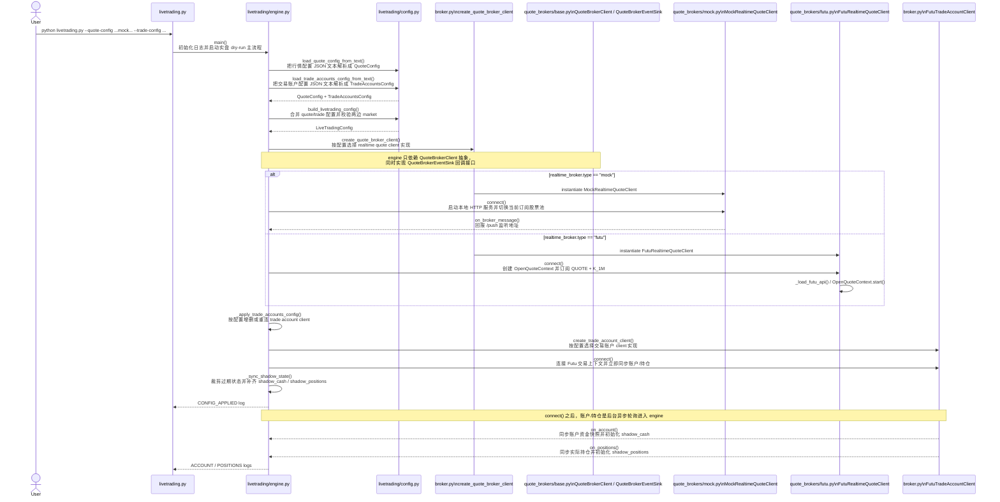
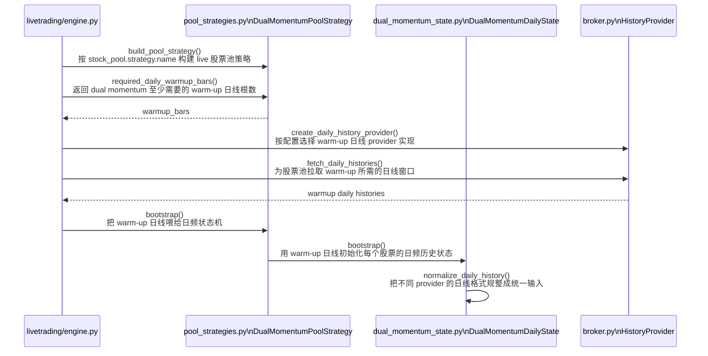
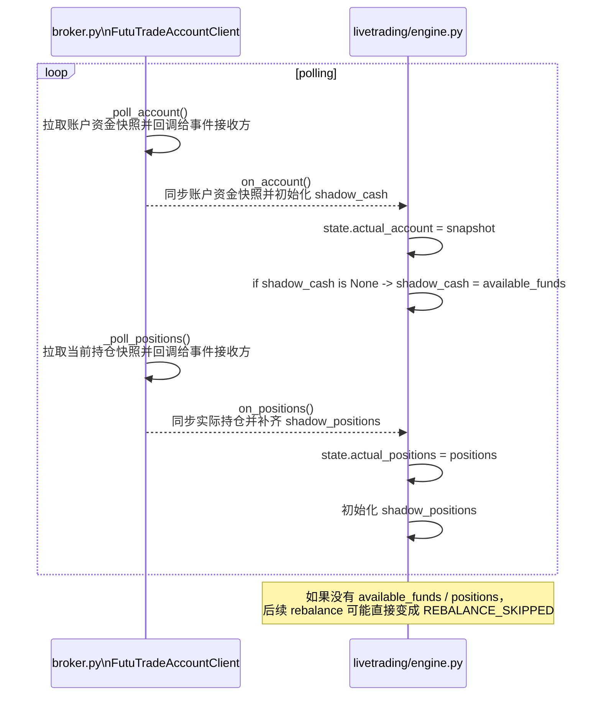
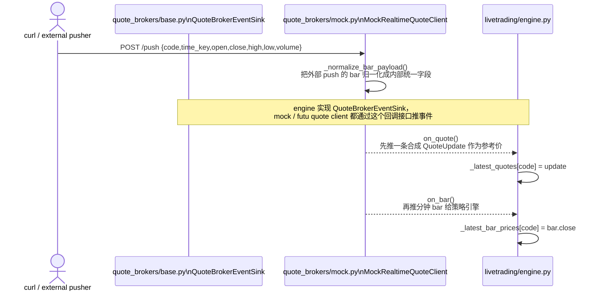
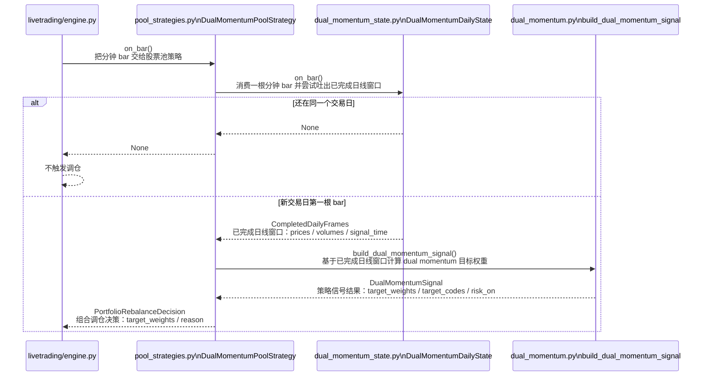
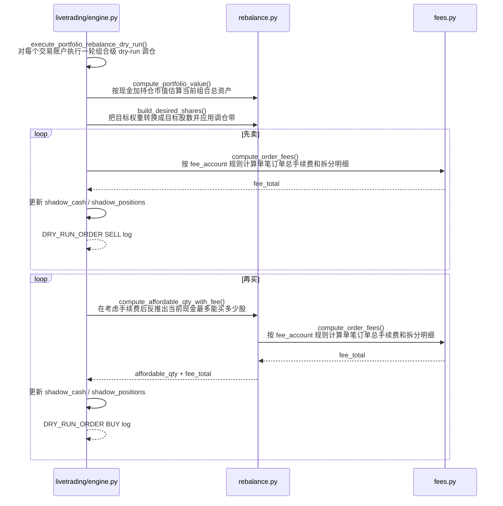

# `livetrading.py` 实盘链路时序图

这份文档针对 `livetrading` 的实盘链路，主要整理关键代码文件之间的时序关系。

下面的启动命令只是为了给时序图提供一个具体入口示例，不代表本文只讨论 `mock` 行情模式。

如果你要看“当前 dry-run 之后，如何继续补齐真实下单链路”，见 [README_livetrading_real_order_plan.md](/Users/sean/workspace/backtest-feature-livetrading-startup/docs/README_livetrading_real_order_plan.md)。

示例命令：

```bash
./.venv/bin/python livetrading.py \
  --quote-config config/livetrading.quote.mock.sample.json \
  --trade-config config/livetrading.trade_accounts.sample.json
```

下面的时序图主要聚焦这些文件之间的交互：

- [livetrading.py](/Users/sean/workspace/backtest-feature-livetrading-startup/livetrading.py)
- [livetrading/engine.py](/Users/sean/workspace/backtest-feature-livetrading-startup/livetrading/engine.py)
- [livetrading/config.py](/Users/sean/workspace/backtest-feature-livetrading-startup/livetrading/config.py)
- [livetrading/broker.py](/Users/sean/workspace/backtest-feature-livetrading-startup/livetrading/broker.py)
- [livetrading/quote_brokers/base.py](/Users/sean/workspace/backtest-feature-livetrading-startup/livetrading/quote_brokers/base.py)
- [livetrading/quote_brokers/mock.py](/Users/sean/workspace/backtest-feature-livetrading-startup/livetrading/quote_brokers/mock.py)
- [livetrading/quote_brokers/futu.py](/Users/sean/workspace/backtest-feature-livetrading-startup/livetrading/quote_brokers/futu.py)
- [livetrading/pool_strategies.py](/Users/sean/workspace/backtest-feature-livetrading-startup/livetrading/pool_strategies.py)
- [strategy/dual_momentum_state.py](/Users/sean/workspace/backtest-feature-livetrading-startup/strategy/dual_momentum_state.py)
- [strategy/dual_momentum.py](/Users/sean/workspace/backtest-feature-livetrading-startup/strategy/dual_momentum.py)
- [strategy/rebalance.py](/Users/sean/workspace/backtest-feature-livetrading-startup/strategy/rebalance.py)
- [strategy/fees.py](/Users/sean/workspace/backtest-feature-livetrading-startup/strategy/fees.py)

下面 Mermaid 里的方法说明，和代码里对应方法的中文注释保持一致，方便你对着图直接跳代码。

## 1. 启动 + 配置加载 + quote client 选择



这一步的关键点：

- `quote_brokers/base.py` 只定义 `QuoteBrokerClient` / `QuoteBrokerEventSink` 抽象
- [livetrading/engine.py](/Users/sean/workspace/backtest-feature-livetrading-startup/livetrading/engine.py) 通过这个抽象持有 realtime quote client
- 当前示例命令走的是 `mock` 分支，但工厂同时也能返回 [livetrading/quote_brokers/futu.py](/Users/sean/workspace/backtest-feature-livetrading-startup/livetrading/quote_brokers/futu.py) 里的 `FutuRealtimeQuoteClient`
- 配置文件读取、broker 初始化、trade account 连接都在这一段完成
- warm-up 本身单独放到下一张图看

## 2. warm-up



这一步的关键点：

- 策略 warm-up 仍然走 `history_broker`
- warm-up 的输出是“已完成日线窗口”，不是直接下单指令
- 真正的账户资金和持仓同步在下一张图里单独看

## 3. 账户同步对后续调仓的影响



这就是为什么现在即使行情改成 mock，仍然需要交易账户侧先同步到资金和持仓。

## 4. mock 推送分钟 K -> 策略出信号 -> dry-run 调仓

### 4.1 mock 接收 `/push` 并把行情送进引擎



### 4.2 分钟 bar 进入策略层，并在换日时决定是否出信号



### 4.3 引擎按账户执行 dry-run 调仓



这里最重要的时序关系是：

1. `mock` 收到 `/push` 后，会先发 `on_quote`，再发 `on_bar`。
2. 策略层只有在“新交易日第一根分钟 bar”到来时，才会从 `DualMomentumDailyState` 吐出已完成日线窗口。
3. `build_dual_momentum_signal(...)` 用这份已完成日线窗口生成目标权重。
4. 引擎拿到 `PortfolioRebalanceDecision` 后，按账户逐个执行 dry-run。
5. dry-run 执行顺序是先卖后买，并且买入数量会显式考虑手续费和剩余现金。

## 5. 文件职责对照

- [livetrading.py](/Users/sean/workspace/backtest-feature-livetrading-startup/livetrading.py)
  - CLI 入口，只负责启动和停止 engine
- [livetrading/config.py](/Users/sean/workspace/backtest-feature-livetrading-startup/livetrading/config.py)
  - 解析 quote / trade 两份配置，拼成 `LiveTradingConfig`
- [livetrading/broker.py](/Users/sean/workspace/backtest-feature-livetrading-startup/livetrading/broker.py)
  - 提供：
    - quote broker factory
    - history provider
    - trade account client
- [livetrading/quote_brokers/base.py](/Users/sean/workspace/backtest-feature-livetrading-startup/livetrading/quote_brokers/base.py)
  - 定义 realtime quote 抽象边界：
    - `QuoteBrokerClient`
    - `QuoteBrokerEventSink`
- [livetrading/quote_brokers/mock.py](/Users/sean/workspace/backtest-feature-livetrading-startup/livetrading/quote_brokers/mock.py)
  - mock 实时行情入口
  - 负责 `/health` / `/push`、bar 归一化、合成 quote、再推 bar
- [livetrading/quote_brokers/futu.py](/Users/sean/workspace/backtest-feature-livetrading-startup/livetrading/quote_brokers/futu.py)
  - Futu 实时行情实现
  - 负责 `OpenQuoteContext`、实时 quote push、分钟 K push
- [livetrading/engine.py](/Users/sean/workspace/backtest-feature-livetrading-startup/livetrading/engine.py)
  - 把行情、账户、策略、dry-run 执行串起来
- [livetrading/pool_strategies.py](/Users/sean/workspace/backtest-feature-livetrading-startup/livetrading/pool_strategies.py)
  - live 侧股票池策略适配层
- [strategy/dual_momentum_state.py](/Users/sean/workspace/backtest-feature-livetrading-startup/strategy/dual_momentum_state.py)
  - 把分钟 bar 增量聚合成“已完成日线窗口”
- [strategy/dual_momentum.py](/Users/sean/workspace/backtest-feature-livetrading-startup/strategy/dual_momentum.py)
  - 纯信号逻辑，输出 `target_weights`
- [strategy/rebalance.py](/Users/sean/workspace/backtest-feature-livetrading-startup/strategy/rebalance.py)
  - 执行层的目标股数、可买数量、调仓带
- [strategy/fees.py](/Users/sean/workspace/backtest-feature-livetrading-startup/strategy/fees.py)
  - 手续费计算

## 6. 一句话总结

这条以 `mock` quote 为主线的实盘链路，本质上是：

```text
HTTP push 的分钟 bar
-> quote_brokers/mock.py
-> quote_brokers/base.py 的 QuoteBrokerEventSink 回调边界
-> engine.py
-> pool_strategies.py
-> dual_momentum_state.py
-> dual_momentum.py
-> rebalance.py + fees.py
-> engine.py 输出 DRY_RUN_ORDER
```

## 7. 相关文档

这份文档现在只保留“运行时序”和“文件职责”。

为了避免和其他文档重复，重构分析已经独立出去：

- 如果你要看怎么启动 mock 并复现 `BUY -> SELL -> BUY`，见 [README_livetrading_mock_signal.md](/Users/sean/workspace/backtest-feature-livetrading-startup/docs/README_livetrading_mock_signal.md)
- 如果你要看当前模块边界、已完成拆分和后续重构顺序，见 [README_livetrading_mock_refactor.md](/Users/sean/workspace/backtest-feature-livetrading-startup/docs/README_livetrading_mock_refactor.md)
